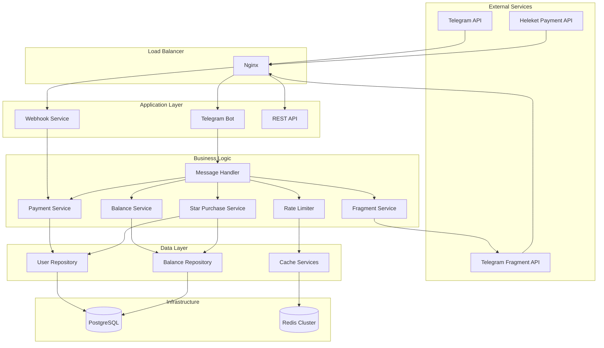
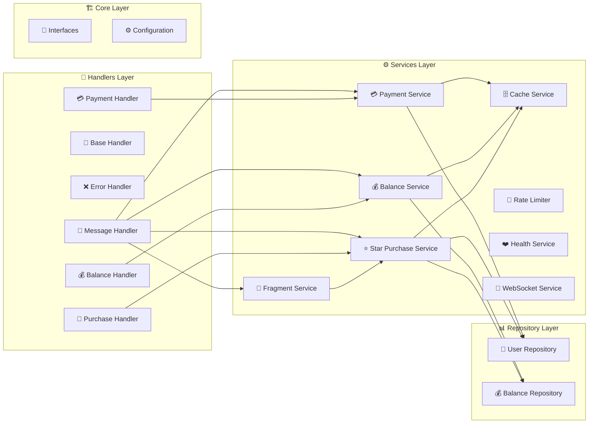
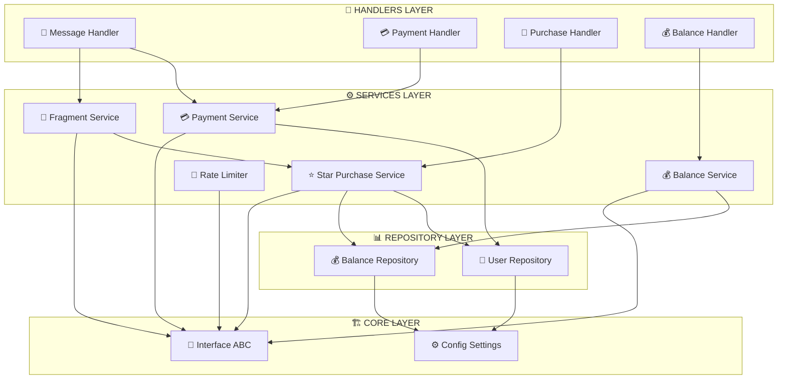
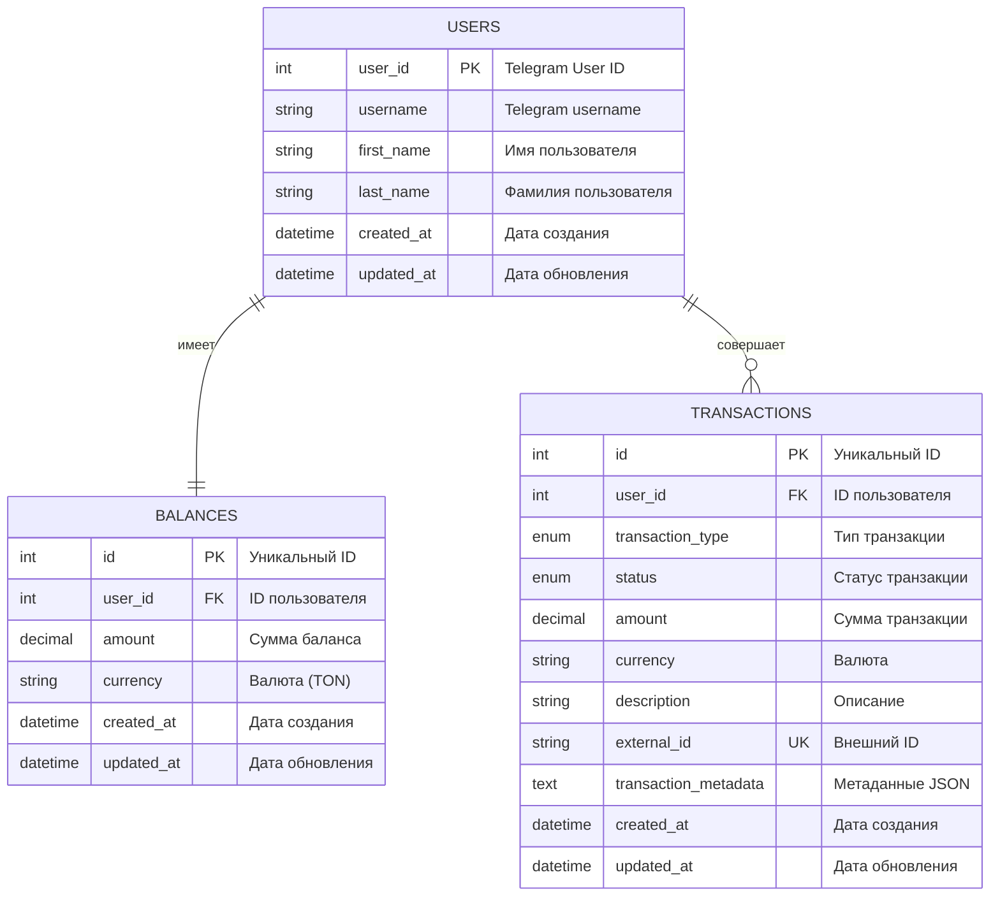
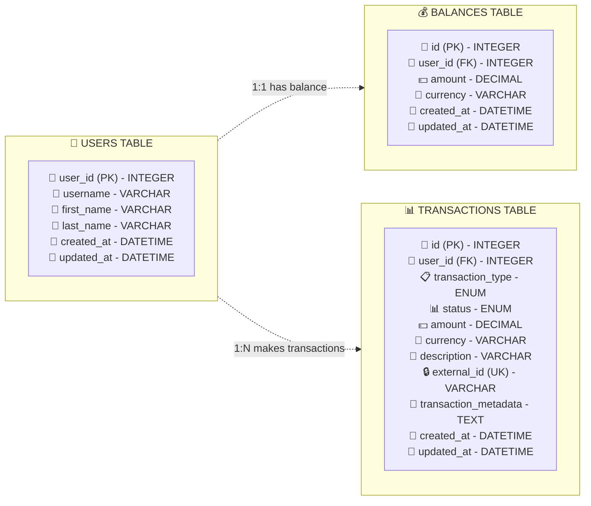
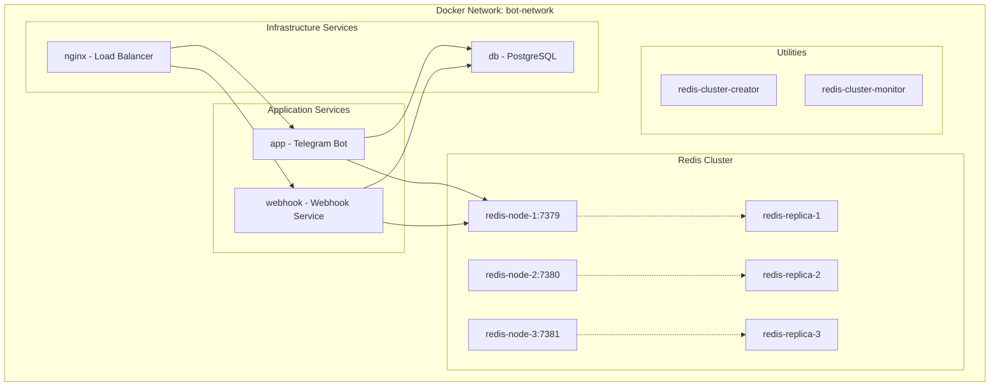
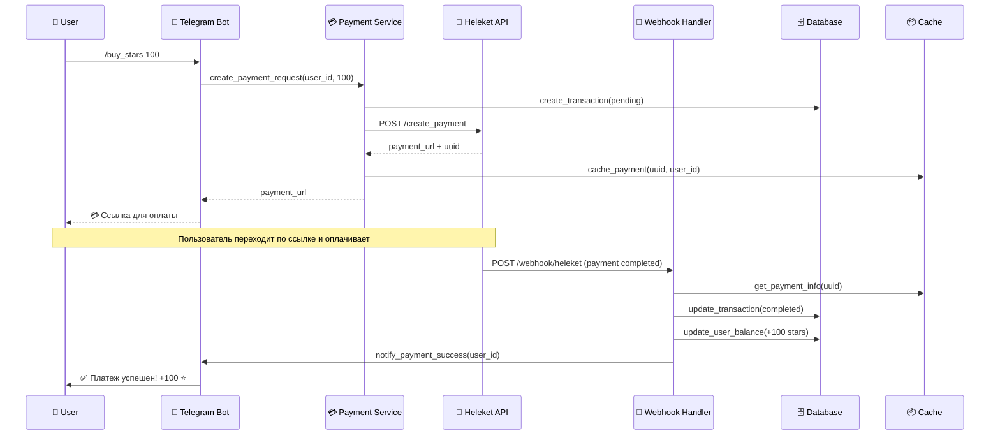
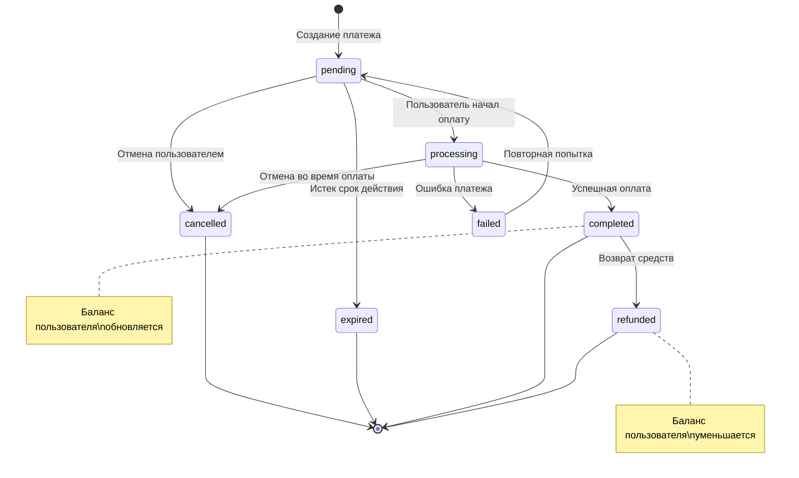
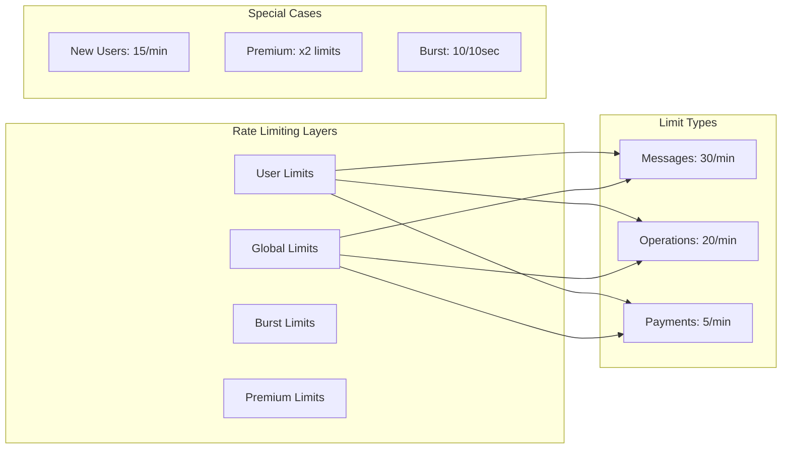
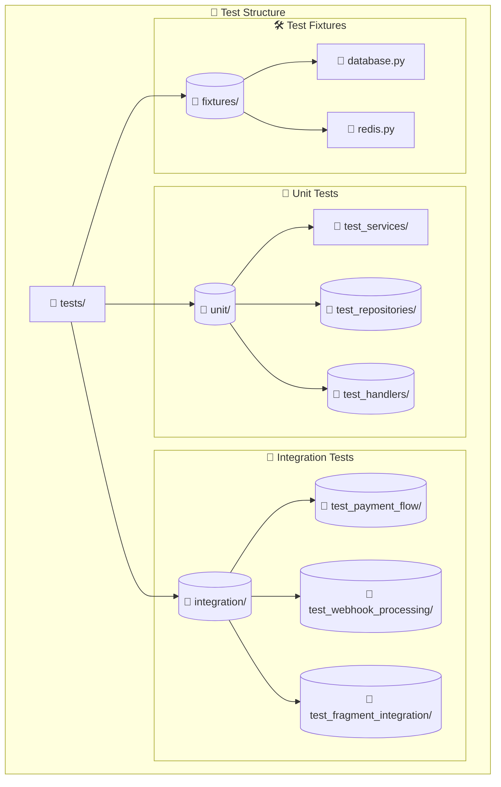

# 🤖 Telegram Bot с Системой Платежей и Балансом

[](https://python.org)
[](https://aiogram.dev)
[](https://postgresql.org)
[](https://redis.io)
[](https://docker.com)

Современный Telegram бот с интегрированной системой платежей Heleket, балансом пользователей, покупкой звезд и продвинутым rate limiting. Архитектура построена на принципах SOLID, DRY, KISS с использованием асинхронного программирования.

## 📋 Содержание

- [🏗️ Архитектура](#️-архитектура)
- [📊 Структура базы данных](#-структура-базы-данных)
- [🛠️ Технологический стек](#️-технологический-стек)
- [⚙️ Установка и настройка](#️-установка-и-настройка)
- [🐳 Docker развертывание](#-docker-развертывание)
- [📡 API и Вебхуки](#-api-и-вебхуки)
- [🔧 Конфигурация](#-конфигурация)
- [📈 Мониторинг](#-мониторинг)
- [🧪 Тестирование](#-тестирование)

## 📚 Дополнительная документация

- [🏗️ Детальная архитектура](docs/ARCHITECTURE.md) - Подробные диаграммы компонентов и паттернов
- [🚀 Развертывание и DevOps](docs/DEPLOYMENT.md) - CI/CD, Docker, инфраструктура
- [💎 Fragment API](docs/fragment.md) - Интеграция с Telegram Fragment для покупки звезд


## 🏗️ Архитектура

### Общая архитектура системы



### Компонентная архитектура



**Слоистая архитектура:**



## 📊 Структура базы данных

### ER-диаграмма



**Детализированная схема базы данных:**



### Описание таблиц

| Таблица | Описание | Ключевые поля |
|---------|----------|---------------|
| **users** | Пользователи Telegram | `user_id` (PK), `username`, `first_name`, `last_name` |
| **balances** | Балансы пользователей | `user_id` (FK), `amount`, `currency` |
| **transactions** | История транзакций | `user_id` (FK), `transaction_type`, `status`, `amount`, `external_id` |

### Типы транзакций

| Тип | Описание |
|-----|----------|
| `purchase` | Покупка звезд |
| `refund` | Возврат средств |
| `bonus` | Бонусные начисления |
| `adjustment` | Корректировки |
| `recharge` | Пополнение баланса |

## 🛠️ Технологический стек

### Backend

| Технология | Версия | Назначение |
|------------|--------|------------|
| **Python** | 3.11+ | Основной язык |
| **aiogram** | 3.21+ | Telegram Bot Framework |
| **FastAPI** | 0.115+ | REST API и вебхуки |
| **SQLAlchemy** | 2.0+ | ORM для работы с БД |
| **Alembic** | 1.13+ | Миграции БД |
| **asyncpg** | 0.29+ | Асинхронный PostgreSQL драйвер |
| **fragment-api-lib** | 1.0+ | Библиотека для работы с Telegram Fragment API |

### Инфраструктура

| Технология | Версия | Назначение |
|------------|--------|------------|
| **PostgreSQL** | 15+ | Основная база данных |
| **Redis** | 7+ | Кеширование и сессии |
| **Nginx** | latest | Reverse proxy и load balancer |
| **Docker** | latest | Контейнеризация |
| **Docker Compose** | latest | Оркестрация сервисов |

### Мониторинг и безопасность

| Технология | Назначение |
|------------|------------|
| **Prometheus** | Метрики и мониторинг |
| **Grafana** | Визуализация метрик |
| **SSL/TLS** | Шифрование соединений |
| **HMAC** | Подписи вебхуков |

## ⚙️ Установка и настройка

### Предварительные требования

- Python 3.11+
- PostgreSQL 15+
- Redis 7+
- Docker и Docker Compose (опционально)

### Локальная установка

1. **Клонирование репозитория**

```bash
git clone <repository-url>
cd telegram-bot-payment-system
```

2. **Создание виртуального окружения**

```bash
python -m venv venv
source venv/bin/activate  # Linux/Mac
# или
venv\Scripts\activate  # Windows
```

3. **Установка зависимостей**

```bash
pip install -r requirements.txt
```

4. **Настройка переменных окружения**

```bash
cp .env.example .env
# Отредактируйте .env файл с вашими настройками
```

5. **Инициализация базы данных**

```bash
alembic upgrade head
```

6. **Запуск приложения**

```bash
python main.py
```

## 🐳 Docker развертывание

### Быстрый старт

```bash
# Клонирование и запуск
git clone <repository-url>
cd telegram-bot-payment-system
cp .env.example .env
# Отредактируйте .env файл
docker-compose up -d
```

### Архитектура Docker



### Docker сервисы

| Сервис | Порт | Описание |
|--------|------|----------|
| **app** | - | Основной Telegram бот |
| **webhook** | 8001 | Сервис обработки вебхуков |
| **db** | 5432 | PostgreSQL база данных |
| **nginx** | 80, 443 | Reverse proxy |
| **redis-node-1** | 7379 | Redis кластер - узел 1 |
| **redis-node-2** | 7380 | Redis кластер - узел 2 |
| **redis-node-3** | 7381 | Redis кластер - узел 3 |

### Автоматическое обновление Fragment cookies

При включенной настройке `FRAGMENT_AUTO_COOKIE_REFRESH=true`:

- Контейнер автоматически устанавливает Chrome и ChromeDriver
- При каждом запуске происходит обновление Fragment cookies
- Во время работы приложения cookies автоматически обновляются при истечении срока действия
- Фоновая задача периодически обновляет cookies с интервалом `FRAGMENT_COOKIE_REFRESH_INTERVAL`
- Cookies сохраняются в файл и используются для всех операций Fragment API

### Ручное обновление cookies

Для ручного обновления cookies:

```bash
# В контейнере
python scripts/update_fragment_cookies.py

# Или через docker-compose
docker-compose exec app python scripts/update_fragment_cookies.py
```

### Проверка состояния Fragment API

Для проверки состояния Fragment API:

```bash
# В контейнере
python scripts/check_fragment_status.py

# Или через docker-compose
docker-compose exec app python scripts/check_fragment_status.py
```

## 📡 API и Вебхуки

### Webhook эндпоинты

| Эндпоинт | Метод | Описание |
|----------|-------|----------|
| `/webhook/heleket` | POST | Обработка платежей от Heleket |
| `/health` | GET | Проверка состояния сервиса |
| `/metrics` | GET | Метрики Prometheus |

### Структура вебхука Heleket

```json
{
  "uuid": "payment_uuid_here",
  "status": "completed",
  "amount": "100.00",
  "currency": "TON",
  "external_id": "user_12345_stars_100",
  "created_at": "2024-01-01T12:00:00Z",
  "metadata": {
    "user_id": 12345,
    "stars_count": 100
  }
}
```

### Диаграмма последовательности платежей



### Диаграмма состояний транзакций



### Rate Limiting



## 🔧 Конфигурация

### Основные настройки

| Категория | Переменная | Значение по умолчанию | Описание |
|-----------|------------|----------------------|----------|
| **Telegram** | `TELEGRAM_TOKEN` | - | Токен Telegram бота |
| **Heleket** | `MERCHANT_UUID` | - | UUID мерчанта |
| **Heleket** | `API_KEY` | - | API ключ |
| **Fragment** | `FRAGMENT_SEED_PHRASE` | - | 24-словная seed фраза TON кошелька (⚠️ СЕКРЕТ!) |
| **Fragment** | `FRAGMENT_COOKIES` | - | Cookies для авторизации в Fragment |
| **Fragment** | `FRAGMENT_AUTO_COOKIE_REFRESH` | `false` | Автоматическое обновление cookies |
| **Fragment** | `FRAGMENT_COOKIE_REFRESH_INTERVAL` | `3600` | Интервал обновления cookies (сек) |
| **Database** | `DATABASE_URL` | `postgresql+asyncpg://...` | URL базы данных |
| **Redis** | `REDIS_URL` | `redis://localhost:7379` | URL Redis |

### Rate Limiting настройки

| Параметр | Значение | Описание |
|----------|----------|----------|
| `RATE_LIMIT_USER_MESSAGES` | 30 | Сообщений в минуту на пользователя |
| `RATE_LIMIT_USER_OPERATIONS` | 20 | Операций в минуту на пользователя |
| `RATE_LIMIT_USER_PAYMENTS` | 5 | Платежей в минуту на пользователя |
| `RATE_LIMIT_GLOBAL_MESSAGES` | 1000 | Глобальный лимит сообщений |
| `RATE_LIMIT_PREMIUM_MULTIPLIER` | 2.0 | Множитель для премиум пользователей |

### Cache настройки

| Параметр | TTL (сек) | Описание |
|----------|-----------|----------|
| `CACHE_TTL_USER` | 1800 | Кеш пользователей |
| `CACHE_TTL_SESSION` | 1800 | Кеш сессий |
| `CACHE_TTL_PAYMENT` | 900 | Кеш платежей |
| `CACHE_TTL_RATE_LIMIT` | 60 | Кеш rate limiting |

## 📈 Мониторинг

### Метрики Prometheus

- **Счетчики**: количество сообщений, платежей, ошибок
- **Гистограммы**: время ответа API, время обработки платежей
- **Gauge**: активные пользователи, размер кеша
- **Rate Limiting**: количество заблокированных запросов

### Health Checks

```bash
# Проверка состояния приложения
curl http://localhost:8001/health

# Проверка метрик
curl http://localhost:8001/metrics
```

### Логирование

- **Уровни**: DEBUG, INFO, WARNING, ERROR, CRITICAL
- **Формат**: JSON для production, текст для development
- **Ротация**: по размеру и времени
- **Централизация**: через Docker logging driver

## 🧪 Тестирование

### Запуск тестов

```bash
# Все тесты
pytest

# С покрытием
pytest --cov=.

# Только unit тесты
pytest tests/unit/

# Только integration тесты
pytest tests/integration/

# Тесты Fragment API
pytest tests/test_fragment_service.py
pytest tests/test_star_purchase_fragment.py
```

### Структура тестов



## 🚀 Производительность

### Оптимизации

- **Асинхронность**: все операции I/O асинхронные
- **Connection Pooling**: пулы соединений для БД и Redis
- **Кеширование**: многоуровневое кеширование
- **Rate Limiting**: защита от перегрузки
- **Circuit Breaker**: устойчивость к сбоям

### Масштабирование

- **Горизонтальное**: несколько экземпляров бота
- **Redis Cluster**: распределенное кеширование
- **Database Sharding**: разделение данных
- **Load Balancing**: распределение нагрузки

### 🔐 Безопасность

- ✅ **MD5 подписи** для вебхуков
- ✅ **SSL/TLS** шифрование
- ✅ **Rate Limiting** защита от DDoS
- ✅ **Input Validation** валидация входных данных
- ✅ **SQL Injection** защита через ORM
- ✅ **Environment Variables** для секретов
- ✅ **Seed Phrase Protection** хранение seed фразы в защищенном виде
- ✅ **Cookie Management** безопасное хранение cookies Fragment
- ✅ **Pre-flight Checks** автоматическая проверка настроек при запуске

### Рекомендации

1. Используйте сильные пароли для БД и Redis
2. Регулярно обновляйте зависимости
3. Мониторьте логи на подозрительную активность
4. Используйте HTTPS для всех внешних соединений
5. Настройте firewall для ограничения доступа
6. Храните seed фразу TON кошелька в защищенном месте
7. Регулярно обновляйте cookies Fragment API
8. Используйте предварительную проверку настроек перед запуском: `python scripts/precheck_fragment.py`

## 📝 Лицензия

Этот проект распространяется под лицензией MIT. См. файл `LICENSE` для подробностей.

## 🤝 Вклад в проект

1. Fork проекта
2. Создайте feature branch (`git checkout -b feature/AmazingFeature`)
3. Commit изменения (`git commit -m 'Add some AmazingFeature'`)
4. Push в branch (`git push origin feature/AmazingFeature`)
5. Откройте Pull Request

## 📞 Поддержка

Если у вас есть вопросы или проблемы:

1. Проверьте [Issues](../../issues) на GitHub
2. Создайте новый Issue с подробным описанием
3. Приложите логи и конфигурацию (без секретов!)

---

**Создано с ❤️ для Telegram Bot разработчиков**
