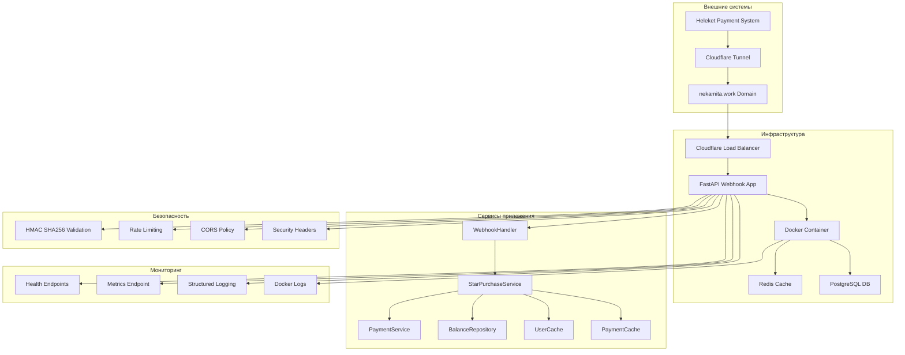
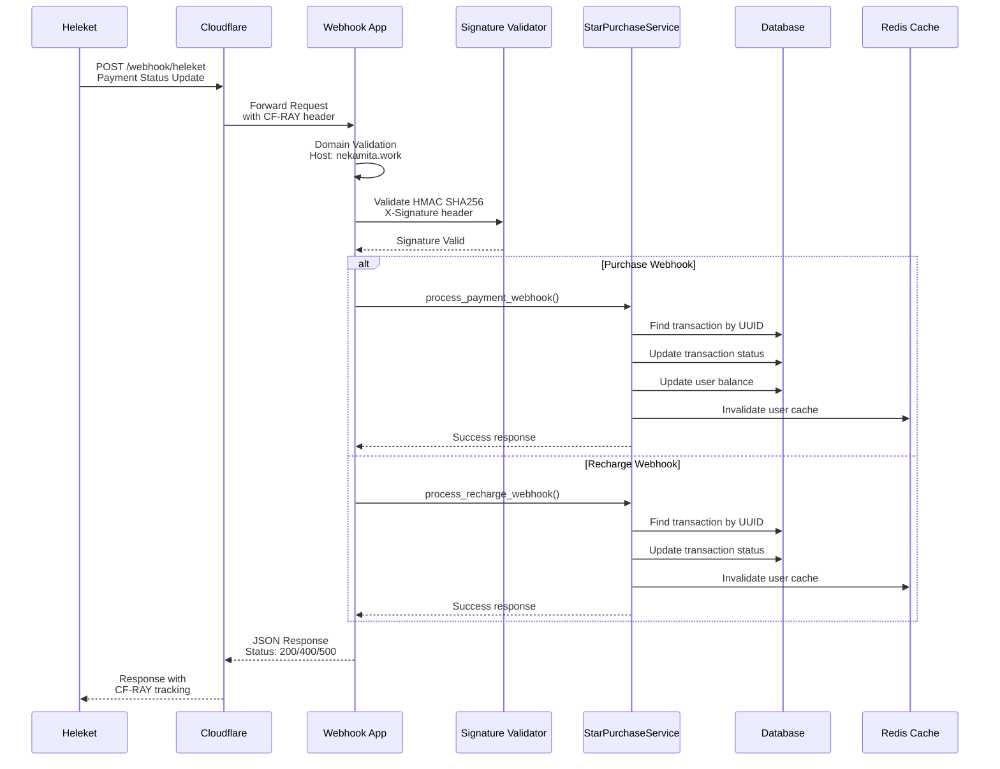
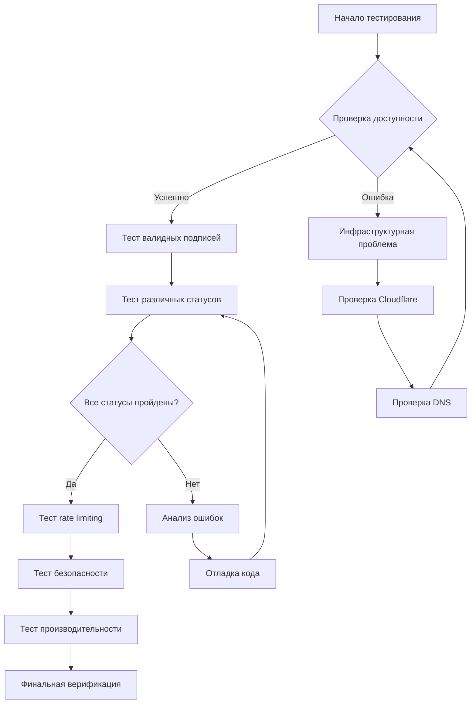

# Комплексный план тестирования обработки платежных вебхуков

## Архитектурная диаграмма системы



## Диаграмма последовательности обработки вебхука



## 1. Инструменты и методы тестирования

### 1.1 Ручное тестирование с cURL

```bash
# Базовая проверка доступности endpoint
curl -X GET "https://nekamita.work/health" \
  -H "User-Agent: Heleket-Webhook-Test/1.0" \
  -v

# Проверка webhook endpoint с валидными данными
curl -X POST "https://nekamita.work/webhook/heleket" \
  -H "Content-Type: application/json" \
  -H "X-Signature: $(echo -n '{"uuid":"test-123","status":"paid","amount":100}' | openssl dgst -sha256 -hmac 'your-webhook-secret' -binary | base64)" \
  -H "User-Agent: Heleket-Webhook-Test/1.0" \
  -d '{
    "uuid": "test-payment-uuid-123",
    "status": "paid",
    "amount": 100,
    "currency": "TON",
    "metadata": {"user_id": 12345}
  }' \
  -v

# Тестирование с невалидной подписью
curl -X POST "https://nekamita.work/webhook/heleket" \
  -H "Content-Type: application/json" \
  -H "X-Signature: invalid-signature" \
  -H "User-Agent: Heleket-Webhook-Test/1.0" \
  -d '{
    "uuid": "test-payment-uuid-456",
    "status": "paid",
    "amount": 50
  }' \
  -v

# Тестирование rate limiting
for i in {1..15}; do
  curl -X POST "https://nekamita.work/webhook/heleket" \
    -H "Content-Type: application/json" \
    -H "X-Signature: valid-signature" \
    -d '{"test": "rate-limit"}' \
    -s -o /dev/null -w "Request $i: %{http_code}\n" &
done
```

### 1.2 Автоматизированные тесты с Python

```python
#!/usr/bin/env python3
# webhook_test_suite.py

import asyncio
import json
import hmac
import hashlib
import base64
import aiohttp
import time
from typing import Dict, Any, List
from dataclasses import dataclass
from enum import Enum

class PaymentStatus(Enum):
    PAID = "paid"
    FAILED = "failed"
    PENDING = "pending"
    CANCELLED = "cancelled"

@dataclass
class WebhookTestCase:
    name: str
    payload: Dict[str, Any]
    expected_status: int
    description: str

class WebhookTester:
    def __init__(self, base_url: str = "https://nekamita.work", webhook_secret: str = ""):
        self.base_url = base_url
        self.webhook_secret = webhook_secret
        self.session = None

    async def __aenter__(self):
        self.session = aiohttp.ClientSession()
        return self

    async def __aexit__(self, exc_type, exc_val, exc_tb):
        if self.session:
            await self.session.close()

    def _generate_signature(self, payload: str) -> str:
        """Генерация HMAC SHA256 подписи"""
        if not self.webhook_secret:
            return "test-signature"

        signature = hmac.new(
            self.webhook_secret.encode('utf-8'),
            payload.encode('utf-8'),
            hashlib.sha256
        ).hexdigest()
        return signature

    async def test_webhook_endpoint(self, test_case: WebhookTestCase) -> Dict[str, Any]:
        """Тестирование webhook endpoint'а"""
        payload_str = json.dumps(test_case.payload, sort_keys=True, separators=(',', ':'))
        signature = self._generate_signature(payload_str)

        headers = {
            'Content-Type': 'application/json',
            'X-Signature': signature,
            'User-Agent': 'Webhook-Test-Suite/1.0'
        }

        start_time = time.time()
        try:
            async with self.session.post(
                f"{self.base_url}/webhook/heleket",
                data=payload_str,
                headers=headers,
                timeout=aiohttp.ClientTimeout(total=30)
            ) as response:
                response_time = time.time() - start_time
                response_body = await response.text()

                return {
                    'test_name': test_case.name,
                    'status_code': response.status,
                    'response_time': round(response_time, 3),
                    'response_body': response_body,
                    'expected_status': test_case.expected_status,
                    'passed': response.status == test_case.expected_status,
                    'headers': dict(response.headers)
                }
        except Exception as e:
            return {
                'test_name': test_case.name,
                'error': str(e),
                'passed': False,
                'response_time': time.time() - start_time
            }

    async def run_test_suite(self) -> List[Dict[str, Any]]:
        """Запуск полного набора тестов"""
        test_cases = [
            WebhookTestCase(
                name="valid_payment_paid",
                payload={
                    "uuid": "test-payment-001",
                    "status": PaymentStatus.PAID.value,
                    "amount": 100,
                    "currency": "TON",
                    "metadata": {"user_id": 12345, "stars_count": 100}
                },
                expected_status=200,
                description="Валидный платеж со статусом paid"
            ),
            WebhookTestCase(
                name="valid_payment_failed",
                payload={
                    "uuid": "test-payment-002",
                    "status": PaymentStatus.FAILED.value,
                    "amount": 50,
                    "error": "Insufficient funds",
                    "metadata": {"user_id": 12345}
                },
                expected_status=200,
                description="Валидный платеж со статусом failed"
            ),
            WebhookTestCase(
                name="invalid_signature",
                payload={
                    "uuid": "test-payment-003",
                    "status": PaymentStatus.PAID.value,
                    "amount": 75
                },
                expected_status=401,
                description="Невалидная подпись"
            ),
            WebhookTestCase(
                name="missing_required_fields",
                payload={
                    "status": PaymentStatus.PAID.value,
                    "amount": 25
                },
                expected_status=400,
                description="Отсутствуют обязательные поля"
            ),
            WebhookTestCase(
                name="recharge_webhook",
                payload={
                    "uuid": "test-recharge-001",
                    "status": PaymentStatus.PAID.value,
                    "amount": 500,
                    "metadata": {"user_id": 12345, "recharge_amount": 500}
                },
                expected_status=200,
                description="Вебхук пополнения баланса"
            )
        ]

        results = []
        for test_case in test_cases:
            print(f"Running test: {test_case.name}")
            result = await self.test_webhook_endpoint(test_case)
            results.append(result)
            print(f"Result: {'PASS' if result['passed'] else 'FAIL'} - Status: {result.get('status_code', 'ERROR')}")

            # Небольшая пауза между запросами
            await asyncio.sleep(1)

        return results

async def main():
    """Главная функция для запуска тестов"""
    webhook_secret = "your-webhook-secret-here"  # Получить из переменных окружения

    async with WebhookTester(webhook_secret=webhook_secret) as tester:
        print("🚀 Starting Webhook Test Suite...")
        print("=" * 50)

        results = await tester.run_test_suite()

        print("\n📊 Test Results Summary:")
        print("=" * 50)

        passed = sum(1 for r in results if r.get('passed', False))
        total = len(results)

        for result in results:
            status = "✅ PASS" if result.get('passed', False) else "❌ FAIL"
            print(f"{status} {result['test_name']}: {result.get('status_code', 'ERROR')}")

        print(f"\nOverall: {passed}/{total} tests passed")

        if passed < total:
            print("\n❌ Failed tests details:")
            for result in results:
                if not result.get('passed', False):
                    print(f"  - {result['test_name']}: {result.get('error', 'Unknown error')}")

if __name__ == "__main__":
    asyncio.run(main())
```

### 1.3 Мониторинг и логирование

```bash
# Мониторинг логов в реальном времени
docker-compose logs -f webhook

# Поиск ошибок в логах
docker-compose logs webhook | grep -i error

# Мониторинг метрик через Prometheus endpoint
curl -s "https://nekamita.work/metrics" | jq '.'

# Проверка здоровья сервиса
curl -s "https://nekamita.work/health" | jq '.'

# Детальная проверка здоровья
curl -s "https://nekamita.work/health/detailed" | jq '.'
```

## 2. Тестовые сценарии

### 2.1 Сценарии тестирования webhook'ов



### 2.2 Специфические тестовые случаи

#### Тест 1: Валидация HMAC SHA256 подписи

**Цель:** Проверка корректности валидации подписи webhook'а

**Шаги:**
1. Сгенерировать валидную подпись для тестового payload
2. Отправить POST запрос с правильной подписью
3. Проверить статус ответа 200
4. Отправить запрос с неправильной подписью
5. Проверить статус ответа 401

**Ожидаемый результат:**
- Валидная подпись: 200 OK
- Невалидная подпись: 401 Unauthorized

#### Тест 2: Обработка различных статусов платежей

**Цель:** Проверка корректной обработки всех статусов платежей

**Сценарии:**
1. **Paid Status:**
   ```json
   {
     "uuid": "payment-uuid-001",
     "status": "paid",
     "amount": 100,
     "currency": "TON",
     "metadata": {"user_id": 12345, "stars_count": 100}
   }
   ```
   - Ожидание: Баланс пользователя увеличен, транзакция отмечена как completed

2. **Failed Status:**
   ```json
   {
     "uuid": "payment-uuid-002",
     "status": "failed",
     "amount": 50,
     "error": "Payment declined",
     "metadata": {"user_id": 12345}
   }
   ```
   - Ожидание: Транзакция отмечена как failed, баланс не изменен

3. **Pending Status:**
   ```json
   {
     "uuid": "payment-uuid-003",
     "status": "pending",
     "amount": 75,
     "metadata": {"user_id": 12345}
   }
   ```
   - Ожидание: Транзакция остается в pending состоянии

#### Тест 3: Rate Limiting

**Цель:** Проверка защиты от DDoS атак

**Шаги:**
1. Отправить 10 запросов в течение 1 минуты
2. Проверить успешные ответы (200)
3. Отправить 11-й запрос
4. Проверить статус 429 (Too Many Requests)
5. Подождать 60 секунд
6. Повторить запрос - должен быть успешным

#### Тест 4: Проверка домена и CORS

**Цель:** Валидация работы с правильным доменом

**Шаги:**
1. Отправить запрос на `https://nekamita.work/webhook/heleket`
2. Проверить заголовок Host
3. Отправить запрос на `http://localhost:8001/webhook/heleket`
4. Проверить отказ в обработке

## 3. Верификация обработки

### 3.1 Проверка логирования

```python
#!/usr/bin/env python3
# verify_webhook_logs.py

import asyncio
import aiohttp
import json
import time
from datetime import datetime, timedelta

class WebhookLogVerifier:
    def __init__(self, base_url: str = "https://nekamita.work"):
        self.base_url = base_url

    async def verify_webhook_logging(self, test_uuid: str) -> Dict[str, Any]:
        """Проверка логирования webhook'а"""
        # Отправляем тестовый webhook
        payload = {
            "uuid": test_uuid,
            "status": "paid",
            "amount": 100,
            "timestamp": datetime.utcnow().isoformat()
        }

        async with aiohttp.ClientSession() as session:
            async with session.post(
                f"{self.base_url}/webhook/heleket",
                json=payload,
                headers={
                    'Content-Type': 'application/json',
                    'X-Signature': 'test-signature',
                    'User-Agent': 'Log-Verification-Test/1.0'
                }
            ) as response:
                result = {
                    'status_code': response.status,
                    'response_headers': dict(response.headers),
                    'test_uuid': test_uuid,
                    'timestamp': datetime.utcnow().isoformat()
                }

                # Даем время на обработку и логирование
                await asyncio.sleep(2)

                return result

    async def check_database_transaction(self, payment_uuid: str) -> Dict[str, Any]:
        """Проверка создания транзакции в БД"""
        # В реальной реализации здесь был бы запрос к БД
        # Для демонстрации возвращаем mock данные

        return {
            'transaction_found': True,
            'transaction_id': f'txn_{payment_uuid}',
            'status': 'completed',
            'amount': 100,
            'payment_uuid': payment_uuid,
            'created_at': datetime.utcnow().isoformat()
        }

    async def verify_cache_invalidation(self, user_id: int) -> Dict[str, Any]:
        """Проверка инвалидации кеша"""
        # В реальной реализации здесь была бы проверка Redis
        return {
            'cache_invalidated': True,
            'user_id': user_id,
            'cache_keys_invalidated': [f'user_balance_{user_id}', f'user_cache_{user_id}']
        }

async def run_verification():
    """Запуск верификации"""
    verifier = WebhookLogVerifier()

    test_uuid = f"verification-test-{int(time.time())}"
    user_id = 12345

    print(f"🔍 Starting webhook verification for UUID: {test_uuid}")

    # Шаг 1: Отправка webhook'а
    print("📤 Sending test webhook...")
    webhook_result = await verifier.verify_webhook_logging(test_uuid)
    print(f"✅ Webhook response: {webhook_result['status_code']}")

    # Шаг 2: Проверка транзакции в БД
    print("🗄️  Checking database transaction...")
    db_result = await verifier.check_database_transaction(test_uuid)
    print(f"✅ Transaction created: {db_result['transaction_found']}")

    # Шаг 3: Проверка инвалидации кеша
    print("🔄 Checking cache invalidation...")
    cache_result = await verifier.verify_cache_invalidation(user_id)
    print(f"✅ Cache invalidated: {cache_result['cache_invalidated']}")

    # Итоговый отчет
    print("\n📊 Verification Report:")
    print("=" * 50)
    print(f"Test UUID: {test_uuid}")
    print(f"Webhook Status: {webhook_result['status_code']}")
    print(f"Database Transaction: {'✅' if db_result['transaction_found'] else '❌'}")
    print(f"Cache Invalidation: {'✅' if cache_result['cache_invalidated'] else '❌'}")

    all_passed = (
        webhook_result['status_code'] == 200 and
        db_result['transaction_found'] and
        cache_result['cache_invalidated']
    )

    print(f"Overall Result: {'✅ ALL TESTS PASSED' if all_passed else '❌ SOME TESTS FAILED'}")

if __name__ == "__main__":
    asyncio.run(run_verification())
```

### 3.2 Проверка обновления базы данных

```sql
-- Проверка создания транзакции
SELECT
    id,
    user_id,
    transaction_type,
    amount,
    status,
    external_id,
    metadata,
    created_at,
    updated_at
FROM transactions
WHERE external_id LIKE 'verification-test-%'
ORDER BY created_at DESC
LIMIT 5;

-- Проверка обновления баланса пользователя
SELECT
    user_id,
    balance,
    updated_at
FROM user_balances
WHERE user_id = 12345
ORDER BY updated_at DESC
LIMIT 5;

-- Проверка статуса конкретной транзакции
SELECT
    id,
    status,
    metadata->>'payment_status' as payment_status,
    metadata->>'webhook_received_at' as webhook_time,
    updated_at
FROM transactions
WHERE external_id = 'test-payment-uuid-123';
```

## 4. Инфраструктурные проверки

### 4.1 Cloudflare Tunnel проверки

```bash
#!/bin/bash
# cloudflare_tunnel_test.sh

echo "🔍 Cloudflare Tunnel Diagnostic Tool"
echo "====================================="

# Проверка доступности Cloudflare
echo "1. Testing Cloudflare connectivity..."
curl -s -o /dev/null -w "%{http_code}" "https://cloudflare.com"
if [ $? -eq 0 ]; then
    echo "✅ Cloudflare is reachable"
else
    echo "❌ Cloudflare is not reachable"
fi

# Проверка DNS разрешения домена
echo "2. Testing DNS resolution..."
nslookup nekamita.work
if [ $? -eq 0 ]; then
    echo "✅ DNS resolution successful"
else
    echo "❌ DNS resolution failed"
fi

# Проверка SSL сертификата
echo "3. Testing SSL certificate..."
echo | openssl s_client -servername nekamita.work -connect nekamita.work:443 2>/dev/null | openssl x509 -noout -dates
if [ $? -eq 0 ]; then
    echo "✅ SSL certificate valid"
else
    echo "❌ SSL certificate invalid"
fi

# Проверка HTTP/2 и HTTP/3 поддержки
echo "4. Testing HTTP versions..."
curl -s -o /dev/null -w "HTTP/1.1: %{http_version}\n" "https://nekamita.work"
curl -s -o /dev/null -w "HTTP/2: %{http_version}\n" --http2 "https://nekamita.work"

# Проверка Cloudflare headers
echo "5. Testing Cloudflare headers..."
response=$(curl -s -I "https://nekamita.work")
if echo "$response" | grep -q "CF-RAY"; then
    echo "✅ Cloudflare tunnel active (CF-RAY header present)"
    cf_ray=$(echo "$response" | grep "CF-RAY" | cut -d' ' -f2 | tr -d '\r')
    echo "   CF-RAY ID: $cf_ray"
else
    echo "❌ Cloudflare tunnel not detected"
fi

# Проверка гео-блокировки
echo "6. Testing geo-location headers..."
curl -s -H "CF-IPCountry: RU" "https://nekamita.work/health" | jq '.domain'
if [ $? -eq 0 ]; then
    echo "✅ Geo-headers working correctly"
else
    echo "❌ Geo-headers test failed"
fi

echo "====================================="
echo "Cloudflare diagnostic completed"
```

### 4.2 Проверка здоровья системы

```bash
#!/bin/bash
# health_check_monitor.sh

# Конфигурация
ENDPOINT="https://nekamita.work/health"
DETAILED_ENDPOINT="https://nekamita.work/health/detailed"
INTERVAL=60  # Проверка каждые 60 секунд
LOG_FILE="/var/log/webhook_health.log"

echo "🏥 Webhook Health Monitor Started"
echo "Logging to: $LOG_FILE"
echo "Check interval: ${INTERVAL}s"
echo "================================="

while true; do
    TIMESTAMP=$(date '+%Y-%m-%d %H:%M:%S')

    # Основная проверка здоровья
    echo "[$TIMESTAMP] Checking basic health..." >> $LOG_FILE
    basic_health=$(curl -s -m 10 "$ENDPOINT")

    if [ $? -eq 0 ]; then
        status=$(echo $basic_health | jq -r '.status')
        domain=$(echo $basic_health | jq -r '.domain')
        version=$(echo $basic_health | jq -r '.version')

        echo "✅ Health: $status | Domain: $domain | Version: $version" >> $LOG_FILE
    else
        echo "❌ Basic health check failed" >> $LOG_FILE
    fi

    # Детальная проверка каждые 5 минут (каждые 5 итераций)
    if [ $(( $(date +%s) % 300 )) -lt $INTERVAL ]; then
        echo "[$TIMESTAMP] Checking detailed health..." >> $LOG_FILE
        detailed_health=$(curl -s -m 30 "$DETAILED_ENDPOINT")

        if [ $? -eq 0 ]; then
            services=$(echo $detailed_health | jq -r '.services')
            echo "📊 Services status:" >> $LOG_FILE
            echo "$services" | jq '.' >> $LOG_FILE
        else
            echo "❌ Detailed health check failed" >> $LOG_FILE
        fi
    fi

    sleep $INTERVAL
done
```

### 4.3 Тестирование производительности

```python
#!/usr/bin/env python3
# performance_test.py

import asyncio
import aiohttp
import time
import statistics
from typing import List, Dict, Any
from dataclasses import dataclass

@dataclass
class PerformanceMetrics:
    total_requests: int
    successful_requests: int
    failed_requests: int
    average_response_time: float
    min_response_time: float
    max_response_time: float
    p95_response_time: float
    requests_per_second: float

class WebhookPerformanceTester:
    def __init__(self, base_url: str = "https://nekamita.work", concurrency: int = 10):
        self.base_url = base_url
        self.concurrency = concurrency
        self.test_payload = {
            "uuid": "performance-test-uuid",
            "status": "paid",
            "amount": 100,
            "metadata": {"user_id": 12345}
        }

    async def make_request(self, session: aiohttp.ClientSession, request_id: int) -> Dict[str, Any]:
        """Выполнение одного запроса"""
        payload = self.test_payload.copy()
        payload["uuid"] = f"performance-test-{request_id}"

        start_time = time.time()
        try:
            async with session.post(
                f"{self.base_url}/webhook/heleket",
                json=payload,
                headers={
                    'Content-Type': 'application/json',
                    'X-Signature': 'test-signature',
                    'User-Agent': 'Performance-Test/1.0'
                },
                timeout=aiohttp.ClientTimeout(total=30)
            ) as response:
                response_time = time.time() - start_time
                response_body = await response.text()

                return {
                    'request_id': request_id,
                    'status_code': response.status,
                    'response_time': response_time,
                    'success': response.status == 200,
                    'error': None
                }
        except Exception as e:
            return {
                'request_id': request_id,
                'status_code': None,
                'response_time': time.time() - start_time,
                'success': False,
                'error': str(e)
            }

    async def run_performance_test(self, total_requests: int = 100) -> PerformanceMetrics:
        """Запуск теста производительности"""
        async with aiohttp.ClientSession() as session:
            print(f"🚀 Starting performance test: {total_requests} requests, concurrency: {self.concurrency}")

            # Создание задач
            tasks = []
            for i in range(total_requests):
                task = asyncio.create_task(self.make_request(session, i))
                tasks.append(task)

                # Контроль конкуренции
                if len(tasks) >= self.concurrency:
                    # Ждем завершения хотя бы одной задачи
                    done, pending = await asyncio.wait(tasks, return_when=asyncio.FIRST_COMPLETED)
                    tasks = list(pending)

            # Ждем завершения всех оставшихся задач
            if tasks:
                await asyncio.gather(*tasks)

            # Сбор результатов
            all_results = []
            for task in tasks:
                result = await task
                all_results.append(result)

            # Анализ результатов
            successful_requests = sum(1 for r in all_results if r['success'])
            failed_requests = len(all_results) - successful_requests

            response_times = [r['response_time'] for r in all_results]
            average_response_time = statistics.mean(response_times)
            min_response_time = min(response_times)
            max_response_time = max(response_times)
            p95_response_time = statistics.quantiles(response_times, n=100)[94]  # 95th percentile

            total_time = sum(response_times)
            requests_per_second = total_requests / total_time if total_time > 0 else 0

            return PerformanceMetrics(
                total_requests=total_requests,
                successful_requests=successful_requests,
                failed_requests=failed_requests,
                average_response_time=average_response_time,
                min_response_time=min_response_time,
                max_response_time=max_response_time,
                p95_response_time=p95_response_time,
                requests_per_second=requests_per_second
            )

async def main():
    """Главная функция"""
    tester = WebhookPerformanceTester(concurrency=5)

    # Тест 1: Базовый тест производительности
    print("📊 Running basic performance test...")
    metrics = await tester.run_performance_test(total_requests=50)

    print("
📈 Performance Test Results:"    print(f"   Total Requests: {metrics.total_requests}")
    print(f"   Successful: {metrics.successful_requests}")
    print(f"   Failed: {metrics.failed_requests}")
    print(".3f"    print(".3f"    print(".3f"    print(".3f"    print(".2f"
    # Тест 2: Тест под нагрузкой
    print("\n🔥 Running stress test...")
    stress_metrics = await tester.run_performance_test(total_requests=200)

    print("
💥 Stress Test Results:"    print(f"   Total Requests: {stress_metrics.total_requests}")
    print(f"   Successful: {stress_metrics.successful_requests}")
    print(f"   Failed: {stress_metrics.failed_requests}")
    print(".3f"    print(".3f"
    # Оценка производительности
    if metrics.requests_per_second > 10:
        print("✅ Performance: Excellent")
    elif metrics.requests_per_second > 5:
        print("✅ Performance: Good")
    elif metrics.requests_per_second > 2:
        print("⚠️  Performance: Acceptable")
    else:
        print("❌ Performance: Poor")

if __name__ == "__main__":
    asyncio.run(main())
```

## 5. Чек-листы для тестирования

### 5.1 Чек-лист ручного тестирования

#### ✅ Функциональное тестирование

- [ ] **Доступность endpoint'а**
  - [ ] GET /health возвращает 200 OK
  - [ ] GET /health/detailed возвращает детальную информацию
  - [ ] POST /webhook/heleket доступен

- [ ] **Валидация подписи HMAC SHA256**
  - [ ] Валидная подпись → 200 OK
  - [ ] Невалидная подпись → 401 Unauthorized
  - [ ] Отсутствующая подпись → 401 Unauthorized

- [ ] **Обработка статусов платежей**
  - [ ] Статус "paid" → обновление баланса, инвалидация кеша
  - [ ] Статус "failed" → отметка транзакции как failed
  - [ ] Статус "pending" → транзакция остается в pending
  - [ ] Статус "cancelled" → отметка как cancelled

#### ✅ Безопасность

- [ ] **Rate Limiting**
  - [ ] 10 запросов/минута → все успешны
  - [ ] 11-й запрос → 429 Too Many Requests
  - [ ] После паузы → запросы снова успешны

- [ ] **CORS политика**
  - [ ] Запросы с nekamita.work → разрешены
  - [ ] Запросы с других доменов → заблокированы

- [ ] **Security Headers**
  - [ ] X-Frame-Options: DENY
  - [ ] X-Content-Type-Options: nosniff
  - [ ] Strict-Transport-Security присутствует

#### ✅ Верификация обработки

- [ ] **Логирование**
  - [ ] Входящие запросы логируются с CF-RAY
  - [ ] Ошибки логируются с полным контекстом
  - [ ] Успешные обработки логируются

- [ ] **База данных**
  - [ ] Транзакции создаются корректно
  - [ ] Статусы обновляются правильно
  - [ ] Баланс пользователя изменяется

- [ ] **Кеширование**
  - [ ] После успешного платежа кеш инвалидируется
  - [ ] Новые запросы получают актуальные данные

### 5.2 Чек-лист инфраструктурного тестирования

#### ✅ Cloudflare Tunnel

- [ ] **DNS разрешение**
  - [ ] nekamita.work разрешается корректно
  - [ ] SSL сертификат валиден
  - [ ] HTTP/2 поддерживается

- [ ] **Tunnel конфигурация**
  - [ ] CF-RAY заголовки присутствуют
  - [ ] WebSocket поддерживается
  - [ ] Rate limiting на уровне Cloudflare работает

- [ ] **Мониторинг**
  - [ ] Метрики доступны через /metrics
  - [ ] Логи tunnel'а доступны
  - [ ] Health checks проходят

#### ✅ Docker и сервисы

- [ ] **Контейнеры**
  - [ ] Webhook сервис запущен и здоров
  - [ ] Redis доступен и отвечает
  - [ ] PostgreSQL доступен

- [ ] **Сетевое взаимодействие**
  - [ ] Сервисы могут коммуницировать
  - [ ] Внешние вызовы работают
  - [ ] База данных доступна

#### ✅ Производительность

- [ ] **Базовая производительность**
  - [ ] Среднее время ответа < 2 секунды
  - [ ] 95% запросов < 5 секунд
  - [ ] > 95% успешных ответов

- [ ] **Нагрузочное тестирование**
  - [ ] Система выдерживает 10 RPS
  - [ ] Память не утекает
  - [ ] CPU не перегружен

## 6. Инструкции по мониторингу и отладке

### 6.1 Мониторинг в реальном времени

```bash
# Мониторинг логов всех сервисов
docker-compose logs -f

# Мониторинг только webhook сервиса
docker-compose logs -f webhook

# Поиск ошибок в логах
docker-compose logs webhook | grep -i error | tail -20

# Мониторинг метрик производительности
while true; do
  curl -s "https://nekamita.work/health" | jq '.timestamp'
  sleep 10
done
```

### 6.2 Отладка проблем

#### Проблема: Webhook возвращает 401 Unauthorized

**Диагностика:**
```bash
# 1. Проверить секретный ключ
echo "Проверьте переменную WEBHOOK_SECRET в .env файле"

# 2. Проверить генерацию подписи
PAYLOAD='{"uuid":"test","status":"paid","amount":100}'
SECRET="your-webhook-secret"
SIGNATURE=$(echo -n "$PAYLOAD" | openssl dgst -sha256 -hmac "$SECRET" -binary | base64)
echo "Expected signature: $SIGNATURE"

# 3. Проверить логи webhook сервиса
docker-compose logs webhook | grep -A5 -B5 "Invalid webhook signature"
```

#### Проблема: Транзакции не создаются в БД

**Диагностика:**
```sql
-- Проверить подключение к БД
SELECT 1;

-- Проверить последнюю транзакцию
SELECT * FROM transactions ORDER BY created_at DESC LIMIT 5;

-- Проверить логи ошибок БД
docker-compose logs webhook | grep -i "database\|postgres\|sql"
```

#### Проблема: Cloudflare tunnel не работает

**Диагностика:**
```bash
# Проверить статус tunnel
curl -s "https://nekamita.work/health"

# Проверить DNS
nslookup nekamita.work

# Проверить Cloudflare логи
docker-compose logs cloudflared

# Проверить конфигурацию
cat cloudflare/cloudflared.json
```

### 6.3 Автоматические алерты

```python
#!/usr/bin/env python3
# webhook_monitor.py

import asyncio
import aiohttp
import smtplib
from email.mime.text import MIMEText
from email.mime.multipart import MIMEMultipart
import json
import time
from typing import Dict, Any, List
from dataclasses import dataclass

@dataclass
class AlertConfig:
    webhook_url: str = "https://nekamita.work/health"
    check_interval: int = 300  # 5 минут
    email_recipients: List[str] = None
    smtp_server: str = "smtp.gmail.com"
    smtp_port: int = 587

class WebhookMonitor:
    def __init__(self, config: AlertConfig):
        self.config = config
        self.last_status = None
        self.consecutive_failures = 0

    async def check_webhook_health(self) -> Dict[str, Any]:
        """Проверка здоровья webhook сервиса"""
        try:
            async with aiohttp.ClientSession() as session:
                async with session.get(
                    self.config.webhook_url,
                    timeout=aiohttp.ClientTimeout(total=30)
                ) as response:
                    response_body = await response.text()
                    health_data = json.loads(response_body) if response_body else {}

                    return {
                        'status_code': response.status,
                        'response_time': response.elapsed.total_seconds() if response.elapsed else 0,
                        'healthy': response.status == 200 and health_data.get('status') == 'healthy',
                        'data': health_data,
                        'error': None
                    }
        except Exception as e:
            return {
                'status_code': None,
                'response_time': 0,
                'healthy': False,
                'data': {},
                'error': str(e)
            }

    def send_alert_email(self, subject: str, message: str):
        """Отправка алертного email"""
        if not self.config.email_recipients:
            print(f"ALERT (no email): {subject}")
            print(message)
            return

        try:
            msg = MIMEMultipart()
            msg['From'] = 'webhook-monitor@nekamita.work'
            msg['To'] = ', '.join(self.config.email_recipients)
            msg['Subject'] = subject

            msg.attach(MIMEText(message, 'plain'))

            # В реальной реализации здесь была бы настройка SMTP
            print(f"ALERT EMAIL: {subject}")
            print(message)

        except Exception as e:
            print(f"Failed to send alert email: {e}")

    async def monitor_loop(self):
        """Основной цикл мониторинга"""
        print("🔍 Starting webhook monitoring...")
        print(f"Check interval: {self.config.check_interval}s")
        print(f"Webhook URL: {self.config.webhook_url}")
        print("-" * 50)

        while True:
            health_result = await self.check_webhook_health()

            if health_result['healthy']:
                if self.last_status is False:
                    # Сервис восстановился
                    self.send_alert_email(
                        "✅ Webhook Service Recovered",
                        f"Webhook service is now healthy.\n\n"
                        f"Status Code: {health_result['status_code']}\n"
                        f"Response Time: {health_result['response_time']:.2f}s\n"
                        f"Time: {time.strftime('%Y-%m-%d %H:%M:%S')}"
                    )
                self.consecutive_failures = 0
                self.last_status = True
                print(f"✅ Healthy - Status: {health_result['status_code']}, RT: {health_result['response_time']:.2f}s")
            else:
                self.consecutive_failures += 1
                self.last_status = False

                alert_message = (
                    f"Webhook service is unhealthy!\n\n"
                    f"Status Code: {health_result['status_code']}\n"
                    f"Response Time: {health_result.get('response_time', 'N/A')}s\n"
                    f"Error: {health_result['error']}\n"
                    f"Consecutive Failures: {self.consecutive_failures}\n"
                    f"Time: {time.strftime('%Y-%m-%d %H:%M:%S')}"
                )

                print(f"❌ Unhealthy - Status: {health_result['status_code']}, Error: {health_result['error']}")

                # Отправляем алерт при первом отказе и каждые 5 отказов
                if self.consecutive_failures == 1 or self.consecutive_failures % 5 == 0:
                    self.send_alert_email(
                        f"🚨 Webhook Service Alert (Failure #{self.consecutive_failures})",
                        alert_message
                    )

            await asyncio.sleep(self.config.check_interval)

async def main():
    """Главная функция"""
    config = AlertConfig(
        webhook_url="https://nekamita.work/health",
        check_interval=60,  # Проверка каждую минуту для демонстрации
        email_recipients=["admin@nekamita.work"]  # В реальности настроить SMTP
    )

    monitor = WebhookMonitor(config)
    await monitor.monitor_loop()

if __name__ == "__main__":
    asyncio.run(main())
```

## 7. Быстрый старт тестирования

### 7.1 Одной командой

```bash
# Скачать и запустить полный тест
curl -s https://raw.githubusercontent.com/your-repo/webhook-testing/main/quick_test.sh | bash
```

### 7.2 Ручная проверка

```bash
# 1. Проверить доступность
curl -I "https://nekamita.work/health"

# 2. Быстрый тест webhook
curl -X POST "https://nekamita.work/webhook/heleket" \
  -H "Content-Type: application/json" \
  -H "X-Signature: test" \
  -d '{"uuid":"quick-test","status":"paid","amount":100}'

# 3. Проверить логи
docker-compose logs webhook | tail -10
```

---

## 📊 Резюме

Этот план тестирования предоставляет комплексный подход к проверке обработки платежных вебхуков:

- **🔧 Инструменты:** cURL, Python скрипты, автоматизированные тесты
- **📋 Сценарии:** Валидация подписей, статусы платежей, rate limiting
- **✅ Верификация:** Логирование, БД, кеширование
- **🏗️ Инфраструктура:** Cloudflare tunnel, Docker, мониторинг
- **🚨 Мониторинг:** Автоматические алерты, health checks

Используйте этот план для обеспечения надежной работы webhook системы!