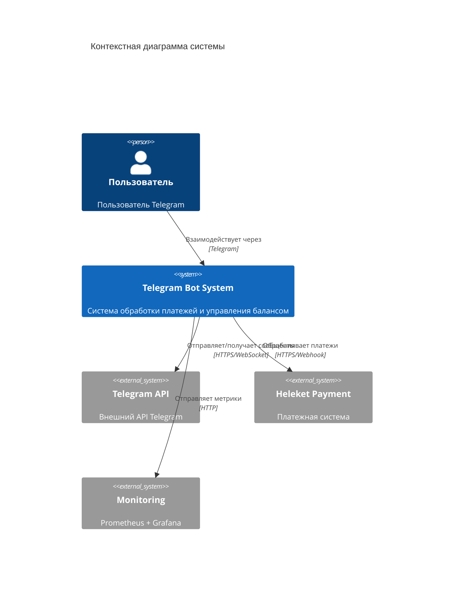
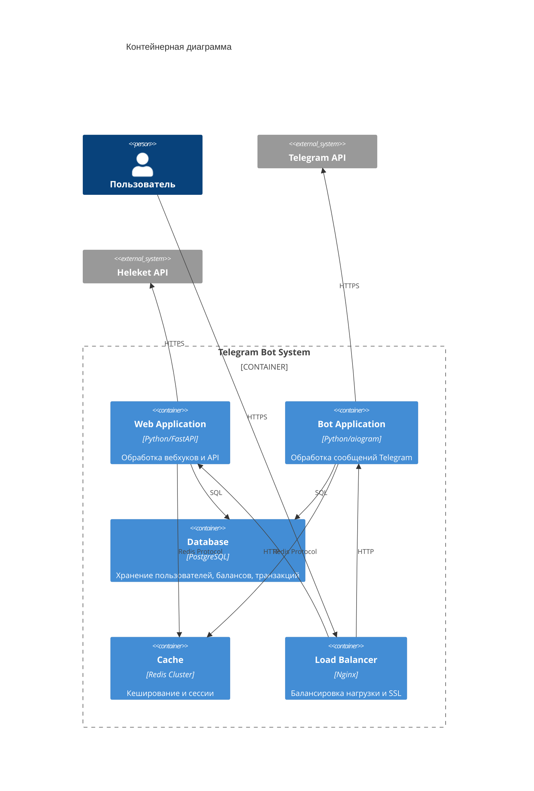
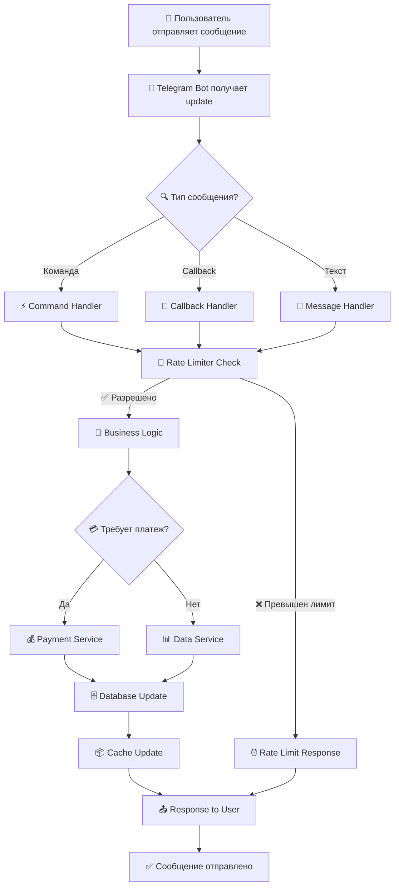
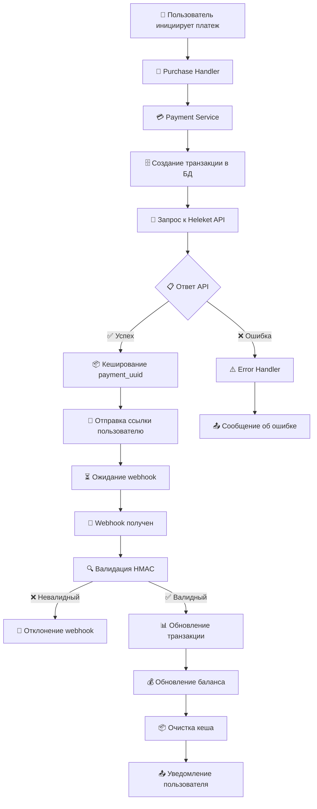
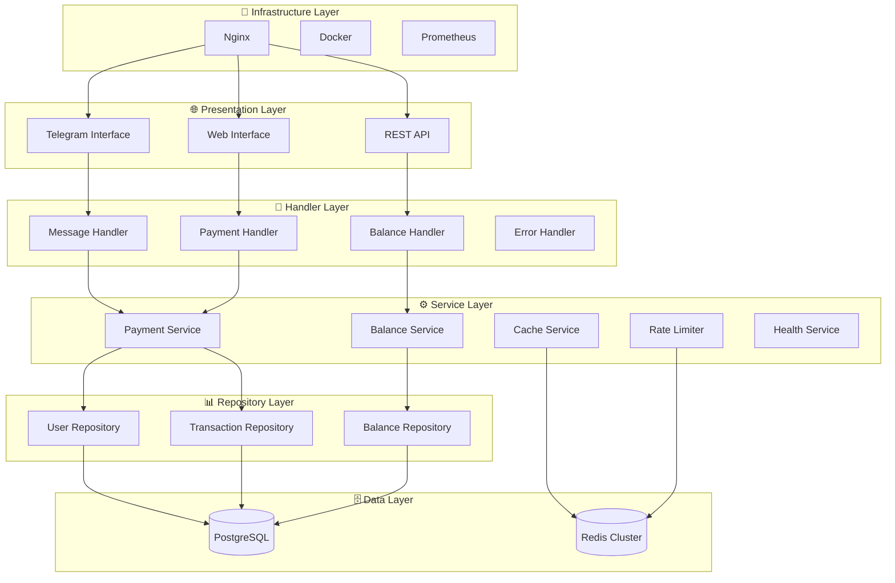
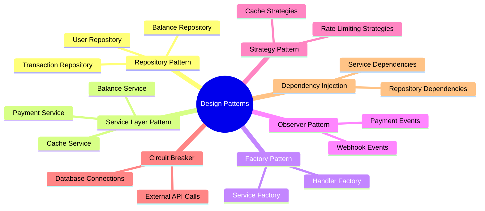
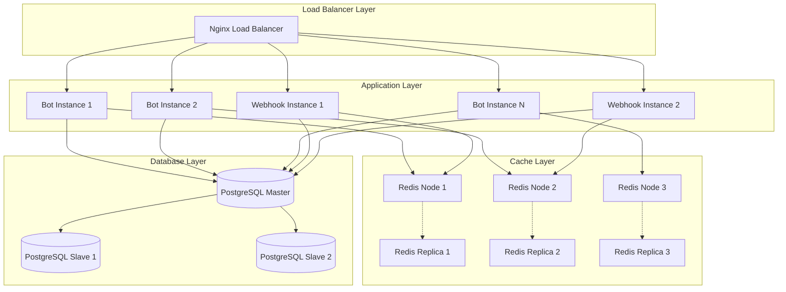
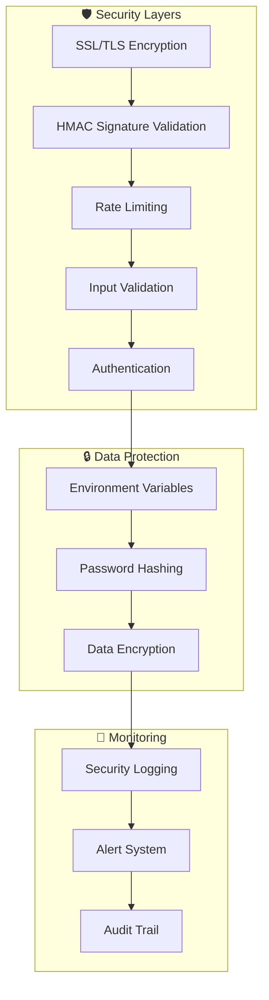
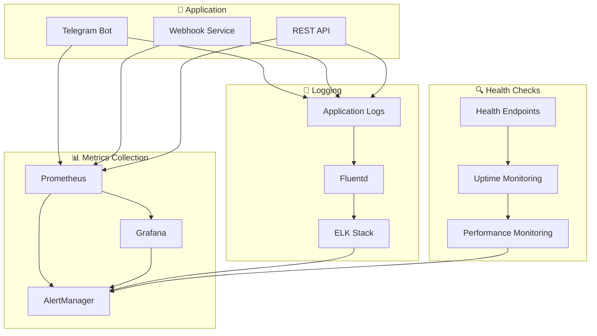

# 🏗️ Архитектурная документация

## Обзор архитектуры

Данный документ содержит детальное описание архитектуры Telegram бота с системой платежей, включая диаграммы компонентов, потоков данных и взаимодействий между сервисами.

## 🎯 Архитектура компонентов

### Общая схема взаимодействия

### Контейнерная диаграмма

## 🔄 Потоки данных

### Поток обработки сообщений

### Поток обработки платежей

## 🏛️ Слои архитектуры

### Детальная схема слоев

## 🔄 Паттерны проектирования

### Используемые паттерны

## 📈 Масштабирование

### Стратегия горизонтального масштабирования

## 🔐 Безопасность

### Схема безопасности

## 📊 Мониторинг и метрики

### Архитектура мониторинга

---

**Документация создана для обеспечения понимания архитектуры системы всеми участниками команды разработки.**