# 🏗️ Архитектурная документация

## Обзор архитектуры

Данный документ содержит детальное описание архитектуры Telegram бота с системой платежей, включая диаграммы компонентов, потоков данных и взаимодействий между сервисами.

## 🎯 Архитектура компонентов

### Общая схема взаимодействия

```mermaid
graph TB
    subgraph "External Systems"
        USER[👤 User]
        TG[📱 Telegram API]
        HELEKET[💳 Heleket Payment]
        MON[📊 Monitoring]
    end
    
    subgraph "Telegram Bot System"
        BOT[🤖 Bot Application]
        WEB[🌐 Web Application]
        DB[(🗄️ Database)]
        CACHE[(📦 Cache)]
    end
    
    USER -->|Messages| TG
    TG -->|Updates| BOT
    BOT -->|Responses| TG
    
    BOT -->|Payment Requests| HELEKET
    HELEKET -->|Webhooks| WEB
    
    BOT -->|Store Data| DB
    WEB -->|Store Data| DB
    
    BOT -->|Cache| CACHE
    WEB -->|Cache| CACHE
    
    BOT -->|Metrics| MON
    WEB -->|Metrics| MON
```

### Контейнерная диаграмма

```mermaid
graph TB
    subgraph "External"
        USER[👤 User]
        TG_API[📱 Telegram API]
        HELEKET_API[💳 Heleket API]
    end
    
    subgraph "Load Balancer"
        NGINX[🔀 Nginx]
    end
    
    subgraph "Application Layer"
        BOT_APP[🤖 Bot Application<br/>Python/aiogram]
        WEB_APP[🌐 Web Application<br/>Python/FastAPI]
    end
    
    subgraph "Data Layer"
        PG[(🗄️ PostgreSQL<br/>Database)]
        REDIS[(📦 Redis Cluster<br/>Cache)]
    end
    
    USER -->|HTTPS| NGINX
    TG_API -->|Webhooks| NGINX
    HELEKET_API -->|Webhooks| NGINX
    
    NGINX -->|HTTP| BOT_APP
    NGINX -->|HTTP| WEB_APP
    
    BOT_APP -->|SQL| PG
    WEB_APP -->|SQL| PG
    
    BOT_APP -->|Redis Protocol| REDIS
    WEB_APP -->|Redis Protocol| REDIS
    
    BOT_APP -->|HTTPS| TG_API
    WEB_APP -->|HTTPS| HELEKET_API
```

## 🔄 Потоки данных

### Поток обработки сообщений

```mermaid
flowchart TD
    A[📱 Пользователь отправляет сообщение] --> B[🤖 Telegram Bot получает update]
    B --> C{🔍 Тип сообщения?}
    
    C -->|Команда| D[⚡ Command Handler]
    C -->|Callback| E[🔘 Callback Handler]
    C -->|Текст| F[📝 Message Handler]
    
    D --> G[🚦 Rate Limiter Check]
    E --> G
    F --> G
    
    G -->|❌ Превышен лимит| H[⏰ Rate Limit Response]
    G -->|✅ Разрешено| I[🔄 Business Logic]
    
    I --> J{💳 Требует платеж?}
    J -->|Да| K[💰 Payment Service]
    J -->|Нет| L[📊 Data Service]
    
    K --> M[🗄️ Database Update]
    L --> M
    
    M --> N[📦 Cache Update]
    N --> O[📤 Response to User]
    
    H --> O
    O --> P[✅ Сообщение отправлено]
```

### Поток обработки платежей

```mermaid
flowchart TD
    A[👤 Пользователь инициирует платеж] --> B[🛒 Purchase Handler]
    B --> C[💳 Payment Service]
    C --> D[🗄️ Создание транзакции в БД]
    D --> E[🏦 Запрос к Heleket API]
    
    E --> F{📋 Ответ API}
    F -->|✅ Успех| G[📦 Кеширование payment_uuid]
    F -->|❌ Ошибка| H[⚠️ Error Handler]
    
    G --> I[🔗 Отправка ссылки пользователю]
    H --> J[📤 Сообщение об ошибке]
    
    I --> K[⏳ Ожидание webhook]
    K --> L[🔗 Webhook получен]
    L --> M[🔍 Валидация HMAC]
    
    M -->|❌ Невалидный| N[🚫 Отклонение webhook]
    M -->|✅ Валидный| O[📊 Обновление транзакции]
    
    O --> P[💰 Обновление баланса]
    P --> Q[📦 Очистка кеша]
    Q --> R[📤 Уведомление пользователя]
    
```

## 🏛️ Слои архитектуры

### Детальная схема слоев

```mermaid
graph TB
    subgraph "🌐 Presentation Layer"
        TG[Telegram Interface]
        WEB[Web Interface]
        API[REST API]
    end
    
    subgraph "🎯 Handler Layer"
        MH[Message Handler]
        PH[Payment Handler]
        BH[Balance Handler]
        EH[Error Handler]
    end
    
    subgraph "⚙️ Service Layer"
        PS[Payment Service]
        BS[Balance Service]
        CS[Cache Service]
        RL[Rate Limiter]
        HS[Health Service]
    end
    
    subgraph "📊 Repository Layer"
        UR[User Repository]
        BR[Balance Repository]
        TR[Transaction Repository]
    end
    
    subgraph "🗄️ Data Layer"
        PG[(PostgreSQL)]
        RD[(Redis Cluster)]
    end
    
    subgraph "🔧 Infrastructure Layer"
        NG[Nginx]
        DC[Docker]
        PR[Prometheus]
    end
    
    %% Connections
    TG --> MH
    WEB --> PH
    API --> BH
    
    MH --> PS
    PH --> PS
    BH --> BS
    
    PS --> UR
    PS --> TR
    BS --> BR
    
    UR --> PG
    BR --> PG
    TR --> PG
    
    CS --> RD
    RL --> RD
    
    NG --> TG
    NG --> WEB
    NG --> API
    
```

## 🔄 Паттерны проектирования

### Используемые паттерны

## 📈 Масштабирование

### Стратегия горизонтального масштабирования

## 🔐 Безопасность

### Схема безопасности

```mermaid
graph TD
    subgraph "🛡️ Security Layers"
        SSL[SSL/TLS Encryption]
        HMAC[HMAC Signature Validation]
        RATE[Rate Limiting]
        VALID[Input Validation]
        AUTH[Authentication]
    end
    
    subgraph "🔒 Data Protection"
        ENV[Environment Variables]
        HASH[Password Hashing]
        ENCRYPT[Data Encryption]
    end
    
    subgraph "🚨 Monitoring"
        LOG[Security Logging]
        ALERT[Alert System]
        AUDIT[Audit Trail]
    end
    
    SSL --> HMAC
    HMAC --> RATE
    RATE --> VALID
    VALID --> AUTH
    
    AUTH --> ENV
    ENV --> HASH
    HASH --> ENCRYPT
    
    ENCRYPT --> LOG
    LOG --> ALERT
    ALERT --> AUDIT
    
```

## 📊 Мониторинг и метрики

### Архитектура мониторинга

```mermaid
graph TB
    subgraph "📱 Application"
        BOT[Telegram Bot]
        WEB[Webhook Service]
        API[REST API]
    end
    
    subgraph "📊 Metrics Collection"
        PROM[Prometheus]
        GRAF[Grafana]
        ALERT[AlertManager]
    end
    
    subgraph "📝 Logging"
        LOGS[Application Logs]
        ELK[ELK Stack]
        FLUENT[Fluentd]
    end
    
    subgraph "🔍 Health Checks"
        HEALTH[Health Endpoints]
        UPTIME[Uptime Monitoring]
        PERF[Performance Monitoring]
    end
    
    BOT --> PROM
    WEB --> PROM
    API --> PROM
    
    BOT --> LOGS
    WEB --> LOGS
    API --> LOGS
    
    PROM --> GRAF
    PROM --> ALERT
    
    LOGS --> FLUENT
    FLUENT --> ELK
    
    HEALTH --> UPTIME
    UPTIME --> PERF
    
    GRAF --> ALERT
    ELK --> ALERT
    PERF --> ALERT
    
```

---

**Документация создана для обеспечения понимания архитектуры системы всеми участниками команды разработки.**