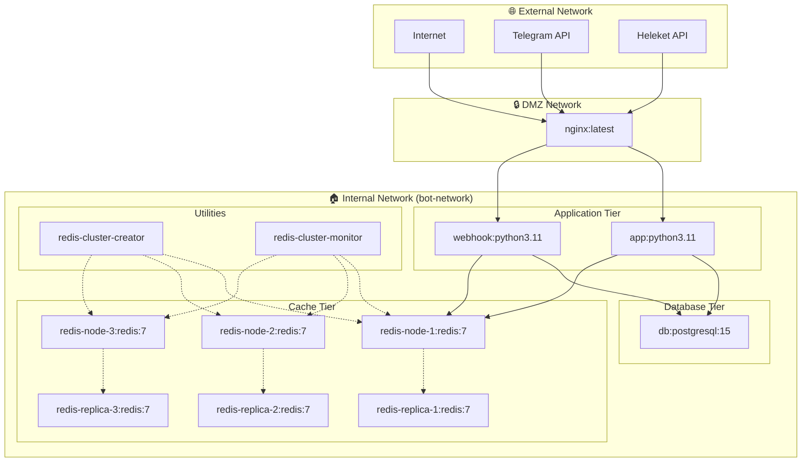
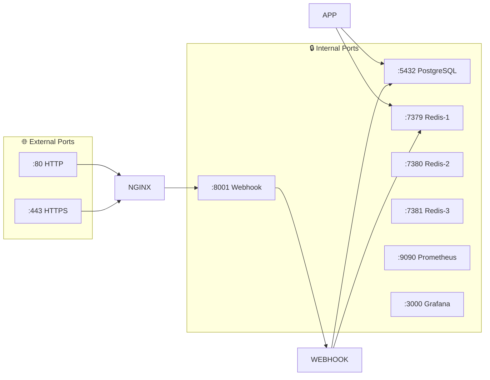
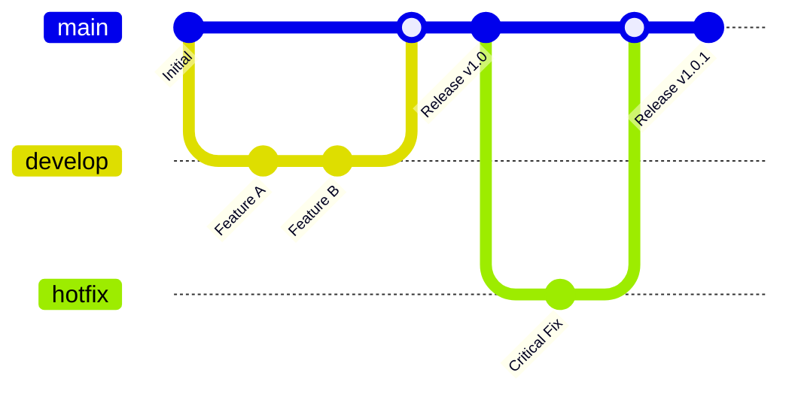
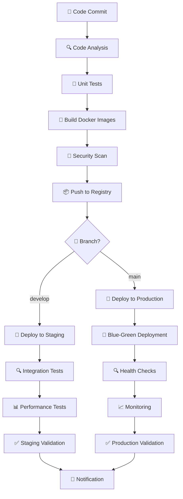
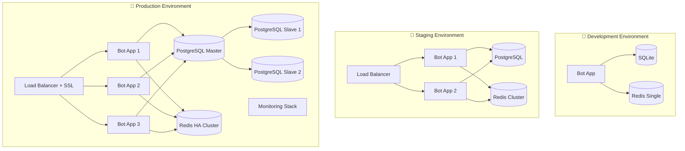
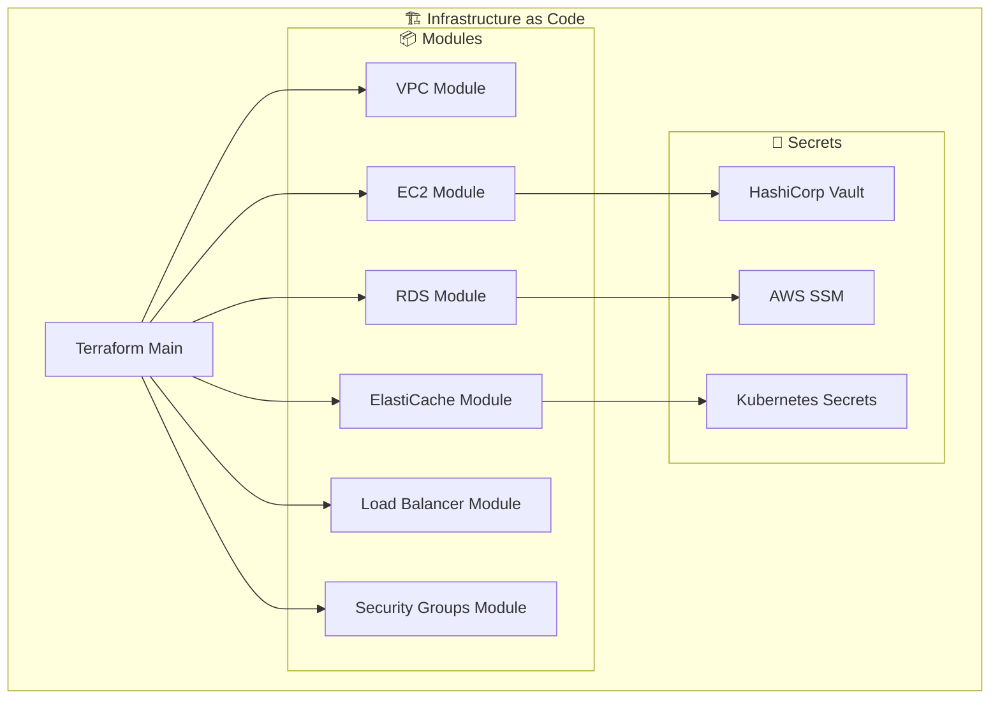
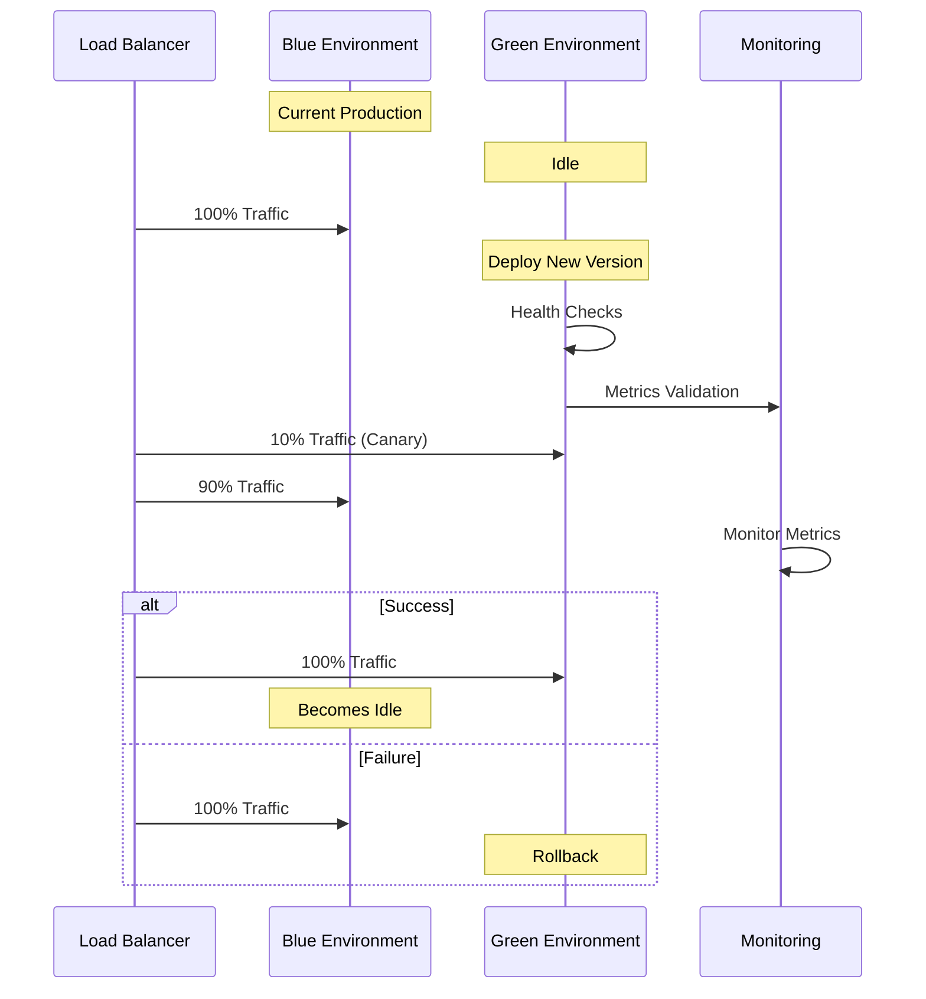
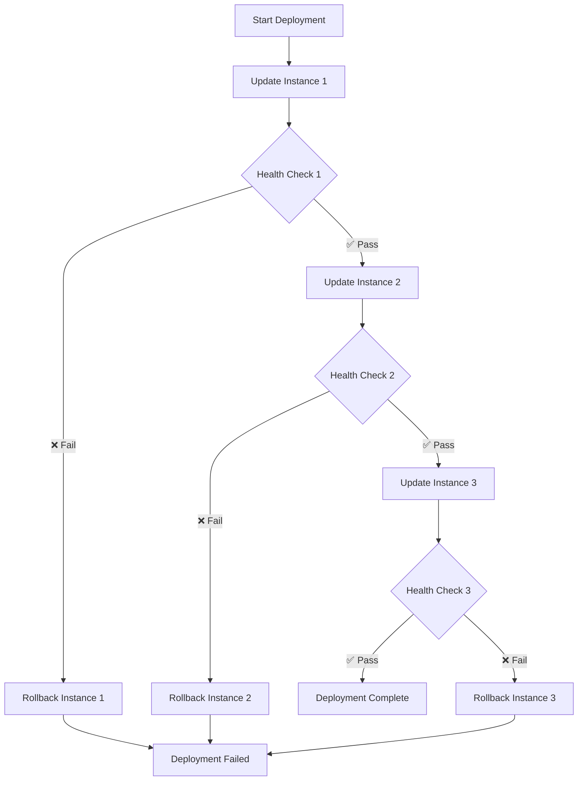
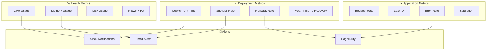
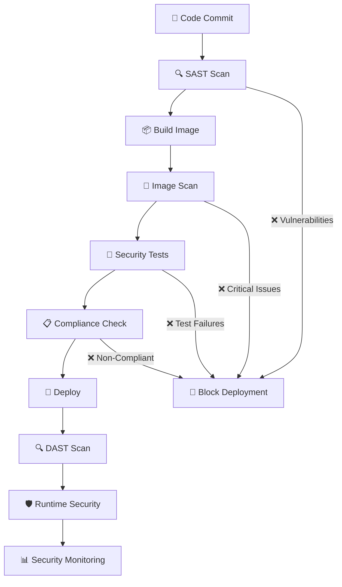

# 🚀 Документация по развертыванию

## Обзор развертывания

Данный документ описывает процессы развертывания, CI/CD пайплайны и инфраструктуру для Telegram бота с системой платежей.

## 🐳 Docker архитектура

### Схема контейнеров



### Порты и сервисы



## 🔄 CI/CD Pipeline

### GitOps процесс



### Deployment Pipeline



## 🌍 Среды развертывания

### Конфигурация сред



## 🔧 Конфигурация инфраструктуры

### Terraform модули



## 🔄 Стратегии развертывания

### Blue-Green Deployment



### Rolling Deployment



## 📊 Мониторинг развертывания

### Deployment Metrics



## 🔐 Безопасность развертывания

### Security Pipeline



---

**Документация по развертыванию обеспечивает надежное и безопасное развертывание системы в различных средах.**
### Cloudflare Интеграция

#### Требуемые API разрешения

Для создания туннелей и управления Cloudflare требуются следующие API токены:

**Zone API Token (для DNS управления):**
- `Zone:Zone:Read` - чтение информации о зонах
- `Zone:DNS:Edit` - управление DNS записями
- `Tunnel:Create` - создание туннелей
- `Tunnel:Read` - чтение конфигурации туннелей
- `Tunnel:Edit` - редактирование туннелей

**Account API Token (для tunnel credentials):**
- `Account:Cloudflare Tunnel:Edit` - управление туннелями на уровне аккаунта
- `Account:Zone:Read` - чтение зон на уровне аккаунта

#### Получение cloudflared-cert.pem

Сертификат создается автоматически при создании туннеля:

```bash
# Установка cloudflared
brew install cloudflare/cloudflare/cloudflared

# Вход в Cloudflare
cloudflared tunnel login

# Создание туннеля
cloudflared tunnel create telegram-bot-tunnel

# Сертификат будет сохранен в ~/.cloudflared/
ls ~/.cloudflared/*.pem

# Копирование в проект
cp ~/.cloudflared/*.pem cloudflare/cloudflared-cert.pem
```

#### Структура файлов

```
cloudflare/
├── cloudflared-cert.pem              # Origin сертификат (из ~/.cloudflared/)
├── cloudflared-credentials.json       # Реальные credentials (исключен из Git)
├── cloudflared-credentials.json.example  # Шаблон credentials (в Git)
├── cloudflared.json                   # Реальная конфигурация tunnel (исключен из Git)
└── cloudflared.json.example           # Шаблон конфигурации tunnel (в Git)
```

#### Переменные окружения

```env
# Cloudflare Tunnel Configuration
CLOUDFLARE_TUNNEL_TOKEN=your_cloudflare_tunnel_token
PRODUCTION_DOMAIN=your-domain.com
ENABLE_HTTPS_REDIRECT=True
```

#### Безопасность

- ✅ **Реальные файлы** с credentials исключены из `.gitignore`
- ✅ **Шаблонные файлы** используются для настройки новых окружений
- ✅ **Никогда не коммитте** файлы без `.example` расширения
- ✅ **Храните** `cloudflared-cert.pem` в безопасном месте

