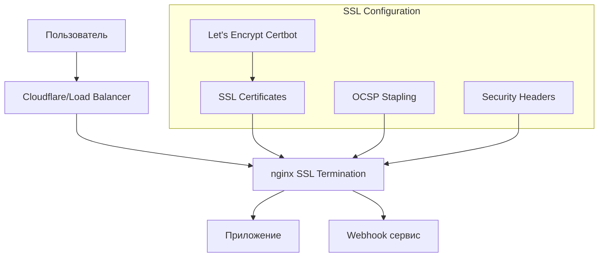

# Настройка SSL/TLS для Production

## Обзор

Этот документ описывает процесс настройки SSL/TLS сертификатов для production среды Telegram бота на домене **yourdomain.com**. Включает настройку лучших практик безопасности, автоматическое обновление сертификатов и мониторинг.

## Архитектура SSL



## Требования

- Docker и Docker Compose
- Домен (или IP адрес)
- Доступ к серверу по SSH
- Certbot (для Let's Encrypt)

## 1. Подготовка сервера

### 1.1 Установка необходимого ПО

```bash
# Обновление системы (Arch Linux)
sudo pacman -Syu --noconfirm

# Установка certbot и nginx
sudo pacman -S --noconfirm certbot nginx-mainline openssl

# Установка Docker (если не установлен)
sudo pacman -S --noconfirm docker docker-compose

# Запуск и включение Docker
sudo systemctl start docker
sudo systemctl enable docker
```

### 1.2 Настройка firewall

```bash
# Настройка firewall (firewalld для Arch Linux)
sudo pacman -S --noconfirm firewalld

# Запуск и включение firewalld
sudo systemctl start firewalld
sudo systemctl enable firewalld

# Разрешаем HTTP, HTTPS и SSH
sudo firewall-cmd --permanent --add-service=http
sudo firewall-cmd --permanent --add-service=https
sudo firewall-cmd --permanent --add-service=ssh
sudo firewall-cmd --reload

# Проверка статуса
sudo firewall-cmd --list-all
```

## 2. Настройка SSL сертификатов

### 2.1 Получение сертификата Let's Encrypt

#### Вариант 1: Standalone (для первого раза)

```bash
# Остановка nginx если работает
sudo systemctl stop nginx

# Получение сертификата для yourdomain.com
sudo certbot certonly --standalone \
  --email admin@yourdomain.com \
  --agree-tos \
  --no-eff-email \
  -d yourdomain.com \
  -d www.yourdomain.com

# Запуск nginx обратно
sudo systemctl start nginx
```

#### Вариант 2: Webroot (рекомендуемый)

```bash
# Создание директории для ACME challenges
sudo mkdir -p /var/www/html/.well-known/acme-challenge
sudo chown -R www-data:www-data /var/www/html

# Получение сертификата для yourdomain.com
sudo certbot certonly --webroot \
  -w /var/www/html \
  --email admin@yourdomain.com \
  --agree-tos \
  --no-eff-email \
  -d yourdomain.com \
  -d www.yourdomain.com
```

### 2.2 Копирование сертификатов в проект

```bash
# Создание директории для SSL в проекте
mkdir -p ssl

# Копирование сертификатов
sudo cp /etc/letsencrypt/live/yourdomain.com/fullchain.pem ./ssl/cert.pem
sudo cp /etc/letsencrypt/live/yourdomain.com/privkey.pem ./ssl/key.pem
sudo cp /etc/letsencrypt/live/yourdomain.com/chain.pem ./ssl/chain.pem

# Установка правильных прав доступа
chmod 644 ./ssl/cert.pem
chmod 600 ./ssl/key.pem
chmod 644 ./ssl/chain.pem
```

## 3. Настройка nginx

### 3.1 Структура файлов

```
nginx/
├── nginx.conf          # Основная конфигурация
└── conf.d/
    └── ssl.conf        # SSL конфигурация
```

### 3.2 Ключевые особенности конфигурации

#### SSL/TLS настройки

```nginx
# Современные протоколы и шифры
ssl_protocols TLSv1.2 TLSv1.3;
ssl_ciphers ECDHE-ECDSA-AES128-GCM-SHA256:ECDHE-RSA-AES128-GCM-SHA256:...;
ssl_prefer_server_ciphers off;

# OCSP Stapling для улучшения производительности
ssl_stapling on;
ssl_stapling_verify on;
resolver 8.8.8.8 8.8.4.4 valid=300s;

# SSL сессии
ssl_session_cache shared:SSL:50m;
ssl_session_timeout 1d;
ssl_session_tickets off;
```

#### Security Headers

```nginx
# HSTS (HTTP Strict Transport Security)
add_header Strict-Transport-Security "max-age=63072000; includeSubDomains; preload" always;

# Защита от XSS, Clickjacking и других атак
add_header X-Frame-Options "SAMEORIGIN" always;
add_header X-Content-Type-Options "nosniff" always;
add_header X-XSS-Protection "1; mode=block" always;
add_header Referrer-Policy "strict-origin-when-cross-origin" always;

# Content Security Policy
add_header Content-Security-Policy "default-src 'self'; ..." always;
```

## 4. Автоматическое обновление сертификатов

### 4.1 Настройка cron job

```bash
# Установка cronie (если не установлен)
sudo pacman -S --noconfirm cronie

# Запуск и включение cron
sudo systemctl start cronie
sudo systemctl enable cronie

# Копирование cron файла
sudo cp scripts/cron/ssl-renewal.cron /etc/cron.d/ssl-renewal

# Установка правильных прав
sudo chmod 644 /etc/cron.d/ssl-renewal
sudo chown root:root /etc/cron.d/ssl-renewal

# Перезапуск cron
sudo systemctl restart cronie
```

### 4.2 Настройка скрипта обновления

```bash
# Редактирование скрипта с вашими данными
vim scripts/ssl-renewal.sh

# Установка переменных окружения
export SSL_DOMAIN="yourdomain.com"
export SSL_EMAIL="admin@yourdomain.com"
```

### 4.3 Тестирование обновления

```bash
# Проверка необходимости обновления
./scripts/ssl-renewal.sh check yourdomain.com

# Ручное обновление
./scripts/ssl-renewal.sh renew yourdomain.com admin@yourdomain.com

# Создание резервной копии
./scripts/ssl-renewal.sh backup
```

## 5. Docker Compose настройка

### 5.1 Обновление docker-compose.yml

```yaml
version: "3.8"

services:
  nginx:
    image: nginx:alpine
    ports:
      - "80:80"
      - "443:443"
    volumes:
      - ./nginx/nginx.conf:/etc/nginx/nginx.conf:ro
      - ./nginx/conf.d:/etc/nginx/conf.d:ro
      - ./ssl:/app:ro
      - ./logs/nginx:/var/log/nginx
    depends_on:
      - app
      - webhook
    restart: unless-stopped

  app:
    build: .
    volumes:
      - ./logs:/app/logs
    environment:
      - ENVIRONMENT=production
    restart: unless-stopped

  webhook:
    build: .
    command: python -m services.webhook.webhook_app
    volumes:
      - ./logs:/app/logs
    environment:
      - ENVIRONMENT=production
    restart: unless-stopped
```

### 5.2 Dockerfile для nginx

```dockerfile
FROM nginx:alpine

# Копирование конфигурации
COPY nginx/nginx.conf /etc/nginx/nginx.conf
COPY nginx/conf.d/ /etc/nginx/conf.d/

# Создание директорий для логов
RUN mkdir -p /var/log/nginx

# Проверка конфигурации
RUN nginx -t

EXPOSE 80 443

CMD ["nginx", "-g", "daemon off;"]
```

## 6. Мониторинг и обслуживание

### 6.1 Проверка статуса сертификатов

```bash
# Проверка даты истечения
openssl x509 -in ssl/cert.pem -noout -enddate

# Проверка цепочки сертификатов
openssl verify -CAfile ssl/chain.pem ssl/cert.pem

# Проверка OCSP
openssl ocsp -issuer ssl/chain.pem -cert ssl/cert.pem -url $(openssl x509 -in ssl/cert.pem -noout -ocsp_uri)
```

### 6.2 Мониторинг логов

```bash
# Просмотр логов обновления SSL
tail -f logs/ssl-renewal.log

# Просмотр nginx логов
tail -f logs/nginx/access.log
tail -f logs/nginx/error.log
```

### 6.3 Проверка конфигурации

```bash
# Тест nginx конфигурации
nginx -t

# Проверка SSL конфигурации
openssl s_client -connect localhost:443 -servername yourdomain.com

# SSL Labs тест
curl -I https://www.ssllabs.com/ssltest/analyze.html?d=yourdomain.com
```

## 7. Безопасность

### 7.1 Защита приватного ключа

```bash
# Установка правильных прав доступа
chmod 600 ssl/key.pem
chown root:root ssl/key.pem

# Не копировать ключ в репозиторий
echo "ssl/key.pem" >> .gitignore
```

### 7.2 Мониторинг уязвимостей

```bash
# Проверка на уязвимые версии OpenSSL
openssl version

# Проверка конфигурации на соответствие best practices
sslscan --no-failed yourdomain.com:443
```

## 8. Troubleshooting

### 8.1 Распространенные проблемы

#### Проблема: Certbot не может получить сертификат

```bash
# Проверка DNS
nslookup yourdomain.com

# Проверка firewall
ufw status

# Проверка порта 80
netstat -tlnp | grep :80
```

#### Проблема: OCSP Stapling не работает

```bash
# Проверка OCSP endpoint
openssl x509 -in ssl/cert.pem -noout -ocsp_uri

# Тест OCSP
openssl ocsp -issuer ssl/chain.pem -cert ssl/cert.pem -url <ocsp_url>
```

#### Проблема: Слабый рейтинг SSL Labs

- Убедитесь, что используются современные cipher suites
- Проверьте HSTS заголовки
- Убедитесь, что OCSP Stapling включен
- Проверьте certificate chain

### 8.2 Логи и диагностика

```bash
# Детальное логирование SSL
nginx -V 2>&1 | grep -o with-ssl

# Проверка SSL handshake
openssl s_client -connect yourdomain.com:443 -debug

# Мониторинг обновлений
./scripts/ssl-renewal.sh check yourdomain.com -v
```

## 9. Best Practices

### 9.1 SSL/TLS

- ✅ Используйте TLS 1.2 и выше
- ✅ Отключите устаревшие cipher suites
- ✅ Включите OCSP Stapling
- ✅ Настройте HSTS
- ✅ Используйте strong Diffie-Hellman parameters

### 9.2 Сертификаты

- ✅ Используйте Let's Encrypt для бесплатных сертификатов
- ✅ Настройте автоматическое обновление
- ✅ Мониторьте срок действия
- ✅ Создавайте резервные копии

### 9.3 Безопасность

- ✅ Защищайте приватные ключи
- ✅ Используйте security headers
- ✅ Регулярно обновляйте ПО
- ✅ Мониторьте логи

## 10. Резервное копирование

### 10.1 Автоматическое резервное копирование

```bash
# Создание скрипта резервного копирования
cat > scripts/backup-ssl.sh << 'EOF'
#!/bin/bash
BACKUP_DIR="/opt/backups/ssl"
TIMESTAMP=$(date +%Y%m%d_%H%M%S)

mkdir -p "$BACKUP_DIR"
tar -czf "$BACKUP_DIR/ssl_backup_$TIMESTAMP.tar.gz" ssl/
EOF

chmod +x scripts/backup-ssl.sh
```

### 10.2 Восстановление из резервной копии

```bash
# Восстановление сертификатов
tar -xzf /opt/backups/ssl/ssl_backup_TIMESTAMP.tar.gz
cp ssl/* /app/

# Перезагрузка nginx
nginx -s reload
```

## Заключение

Эта настройка обеспечивает production-ready SSL/TLS конфигурацию с автоматическим обновлением сертификатов и мониторингом. Регулярно проверяйте логи и обновляйте систему безопасности.

## Ссылки

- [Let's Encrypt Documentation](https://letsencrypt.org/docs/)
- [Mozilla SSL Configuration Generator](https://ssl-config.mozilla.org/)
- [SSL Labs Server Test](https://www.ssllabs.com/ssltest/)
- [OWASP TLS Cheat Sheet](https://cheatsheetseries.owasp.org/cheatsheets/TLS_Cheat_Sheet.html)
