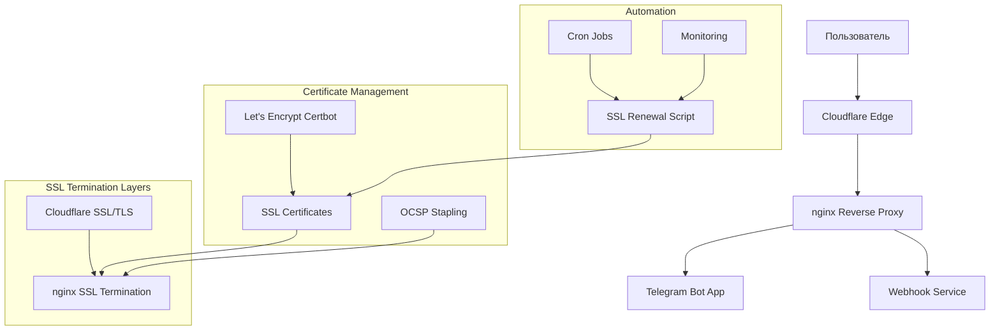
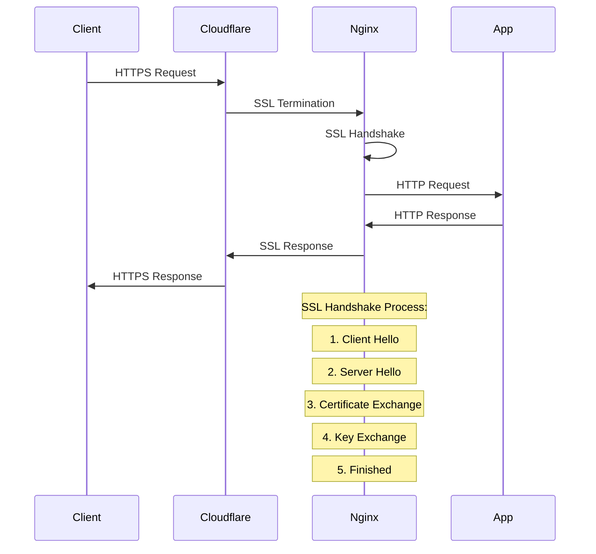
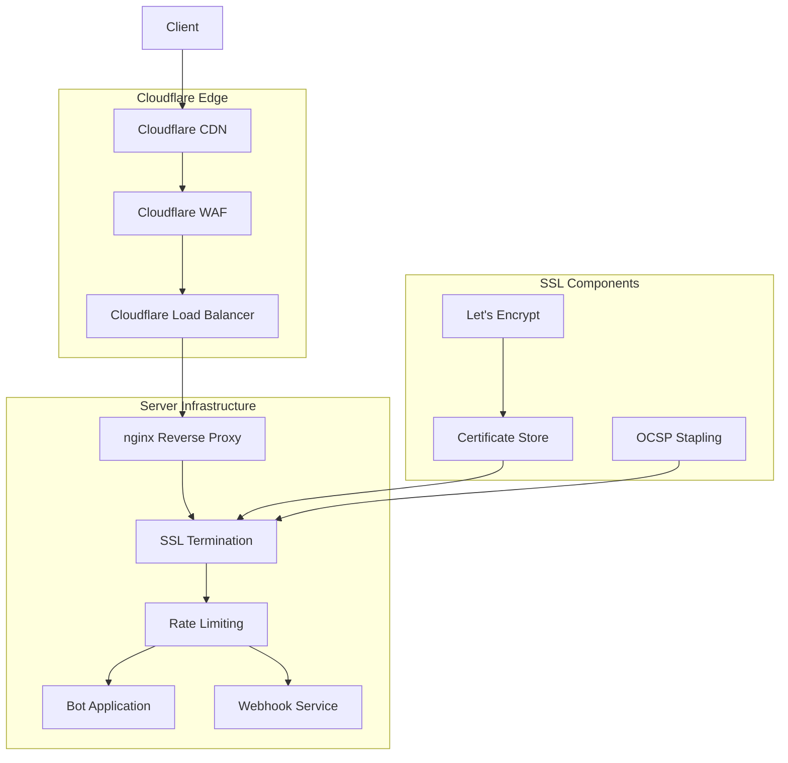

# Настройка SSL/TLS для Mirza Telegram Shop Bot

## Обзор

Этот документ предоставляет исчерпывающие инструкции по настройке SSL/TLS сертификатов для production среды Telegram бота. Включает генерацию сертификатов Let's Encrypt, интеграцию с nginx, Cloudflare SSL/TLS настройки, автоматическое обновление, мониторинг и troubleshooting.

## Архитектура SSL/TLS



## Требования

- Docker и Docker Compose
- Домен (или IP адрес)
- Доступ к серверу по SSH
- Certbot (для Let's Encrypt)
- Cloudflare аккаунт (рекомендуется)

## 1. Подготовка инфраструктуры

### 1.1 Установка необходимого ПО

```bash
# Обновление системы
sudo pacman -Syu --noconfirm

# Установка certbot, nginx и cloudflared
sudo pacman -S --noconfirm certbot nginx-mainline openssl cloudflared

# Установка Docker
sudo pacman -S --noconfirm docker docker-compose

# Запуск и включение сервисов
sudo systemctl start docker
sudo systemctl enable docker
sudo systemctl start nginx
sudo systemctl enable nginx
```

### 1.2 Настройка firewall

```bash
# Установка firewalld
sudo pacman -S --noconfirm firewalld
sudo systemctl start firewalld
sudo systemctl enable firewalld

# Настройка правил
sudo firewall-cmd --permanent --add-service=http
sudo firewall-cmd --permanent --add-service=https
sudo firewall-cmd --permanent --add-service=ssh
sudo firewall-cmd --reload

# Проверка статуса
sudo firewall-cmd --list-all
```

## 2. Настройка домена в Cloudflare

### 2.1 Добавление домена

```bash
# Войдите в Cloudflare dashboard и добавьте ваш домен
# Установите nameservers на ваш регистратор доменов
```

### 2.2 Настройка DNS записей

```
Type: A
Name: yourdomain.com
Content: YOUR_SERVER_IP
TTL: Auto

Type: CNAME
Name: www
Content: yourdomain.com
TTL: Auto
```

### 2.3 Настройка SSL/TLS в Cloudflare

1. Перейдите в SSL/TLS > Overview
2. Выберите "Full (strict)" режим
3. Включите "Always Use HTTPS"
4. Настройте HSTS с preload

### 2.4 Настройка Cloudflare Tunnel (cloudflared)

```bash
# Установка cloudflared
sudo cloudflared service install YOUR_TOKEN

# Создание tunnel
cloudflared tunnel create telegram-bot-tunnel

# Настройка credentials
sudo mkdir -p /etc/cloudflared
sudo cp cloudflare/cloudflared-credentials.json /etc/cloudflared/credentials.json

# Настройка конфигурации
sudo cp cloudflare/cloudflared.json /etc/cloudflared/config.yml

# Запуск tunnel
sudo cloudflared service install YOUR_TOKEN
sudo systemctl start cloudflared
sudo systemctl enable cloudflared
```

## 3. Генерация SSL сертификатов Let's Encrypt

### 3.1 Установка Certbot

```bash
# Установка certbot с DNS challenge plugin
sudo pacman -S --noconfirm certbot-dns-cloudflare
```

### 3.2 Настройка Cloudflare API токена

```bash
# Создание файла с credentials
sudo mkdir -p /etc/letsencrypt
sudo tee /etc/letsencrypt/cloudflare.ini > /dev/null <<EOF
dns_cloudflare_email = your-email@example.com
dns_cloudflare_api_key = YOUR_CLOUDFLARE_API_KEY
EOF

# Установка правильных прав доступа
sudo chmod 600 /etc/letsencrypt/cloudflare.ini
```

### 3.3 Получение wildcard сертификата

```bash
# Получение wildcard сертификата
sudo certbot certonly \
  --dns-cloudflare \
  --dns-cloudflare-credentials /etc/letsencrypt/cloudflare.ini \
  --email your-email@example.com \
  --agree-tos \
  --no-eff-email \
  -d yourdomain.com \
  -d *.yourdomain.com
```

### 3.4 Получение обычного сертификата (webroot)

```bash
# Создание директории для ACME challenges
sudo mkdir -p /var/www/html/.well-known/acme-challenge
sudo chown -R www-data:www-data /var/www/html

# Получение сертификата
sudo certbot certonly --webroot \
  -w /var/www/html \
  --email your-email@example.com \
  --agree-tos \
  --no-eff-email \
  -d yourdomain.com \
  -d www.yourdomain.com
```

## 4. Интеграция с nginx

### 4.1 Структура конфигурации nginx

```
nginx/
├── nginx.conf          # Основная конфигурация
└── conf.d/
    └── ssl.conf        # SSL конфигурация
```

### 4.2 Основная конфигурация nginx

Файл `nginx/nginx.conf` уже настроен с необходимыми upstream и включением SSL конфигурации.

### 4.3 SSL конфигурация

Файл `nginx/conf.d/ssl.conf` содержит полную SSL конфигурацию с:

- Современными протоколами TLS 1.2/1.3
- Безопасными cipher suites
- OCSP Stapling
- Security headers
- HTTP/2 поддержка

### 4.4 Копирование сертификатов

```bash
# Создание директории для SSL
mkdir -p ssl

# Копирование сертификатов
sudo cp /etc/letsencrypt/live/yourdomain.com/fullchain.pem ./ssl/cert.pem
sudo cp /etc/letsencrypt/live/yourdomain.com/privkey.pem ./ssl/key.pem
sudo cp /etc/letsencrypt/live/yourdomain.com/chain.pem ./ssl/chain.pem

# Установка правильных прав доступа
chmod 644 ./ssl/cert.pem
chmod 600 ./ssl/key.pem
chmod 644 ./ssl/chain.pem
```

## 5. Автоматическое обновление сертификатов

### 5.1 Скрипт обновления

Скрипт `scripts/ssl-renewal.sh` предоставляет полную автоматизацию:

```bash
# Проверка необходимости обновления
./scripts/ssl-renewal.sh check yourdomain.com

# Ручное обновление
./scripts/ssl-renewal.sh renew yourdomain.com admin@yourdomain.com

# Создание резервной копии
./scripts/ssl-renewal.sh backup
```

### 5.2 Настройка cron задач

```bash
# Копирование cron файла
sudo cp scripts/cron/ssl-renewal.cron /etc/cron.d/ssl-renewal

# Установка правильных прав
sudo chmod 644 /etc/cron.d/ssl-renewal
sudo chown root:root /etc/cron.d/ssl-renewal

# Перезапуск cron
sudo systemctl restart cronie
```

### 5.3 Мониторинг обновлений

```bash
# Просмотр логов обновления
tail -f logs/ssl-renewal.log

# Проверка статуса cron
sudo systemctl status cronie
```

## 6. Безопасность SSL/TLS

### 6.1 Защита приватного ключа

```bash
# Установка правильных прав доступа
chmod 600 ssl/key.pem
chown root:root ssl/key.pem

# Исключение ключа из git
echo "ssl/key.pem" >> .gitignore
```

### 6.2 SSL Pinning

```nginx
# Добавьте в nginx конфигурацию
add_header Public-Key-Pins 'pin-sha256="BASE64_CERT_PIN"; max-age=5184000; includeSubDomains';
```

### 6.3 Security Headers

Конфигурация включает полную настройку security headers:

- HSTS (HTTP Strict Transport Security)
- X-Frame-Options
- X-Content-Type-Options
- X-XSS-Protection
- Content Security Policy

## 7. HTTP/2 и QUIC протоколы

### 7.1 HTTP/2 в nginx

```nginx
# Включение HTTP/2
listen 443 ssl http2;
listen [::]:443 ssl http2;
```

### 7.2 Настройка QUIC (HTTP/3)

```nginx
# Для HTTP/3 требуется nginx с QUIC поддержкой
# Установка nginx с QUIC
sudo pacman -S --noconfirm nginx-mainline-quic

# Конфигурация QUIC
listen 443 quic reuseport;
listen [::]:443 quic reuseport;

add_header Alt-Svc 'h3=":443"; ma=86400';
```

## 8. Мониторинг SSL статуса

### 8.1 Проверка сертификатов

```bash
# Проверка даты истечения
openssl x509 -in ssl/cert.pem -noout -enddate

# Проверка цепочки сертификатов
openssl verify -CAfile ssl/chain.pem ssl/cert.pem

# Проверка OCSP
openssl ocsp -issuer ssl/chain.pem -cert ssl/cert.pem -url $(openssl x509 -in ssl/cert.pem -noout -ocsp_uri)
```

### 8.2 SSL Labs тест

```bash
# Онлайн тест SSL конфигурации
curl -I https://www.ssllabs.com/ssltest/analyze.html?d=yourdomain.com
```

### 8.3 Мониторинг с Prometheus/Grafana

```yaml
# prometheus.yml
scrape_configs:
  - job_name: 'ssl-exporter'
    static_configs:
      - targets: ['localhost:9219']
```

## 9. Docker Compose настройка

### 9.1 Обновленный docker-compose.yml

```yaml
version: "3.8"

services:
  nginx:
    image: nginx:alpine
    ports:
      - "80:80"
      - "443:443"
    volumes:
      - ./nginx/nginx.conf:/etc/nginx/nginx.conf:ro
      - ./nginx/conf.d:/etc/nginx/conf.d:ro
      - ./ssl:/app:ro
      - ./logs/nginx:/var/log/nginx
    depends_on:
      - app
      - webhook
    restart: unless-stopped

  app:
    build: .
    volumes:
      - ./logs:/app/logs
    environment:
      - ENVIRONMENT=production
    restart: unless-stopped

  webhook:
    build: .
    command: python -m services.webhook.webhook_app
    volumes:
      - ./logs:/app/logs
    environment:
      - ENVIRONMENT=production
    restart: unless-stopped

  cloudflared:
    image: cloudflare/cloudflared:latest
    command: tunnel run
    environment:
      - TUNNEL_TOKEN=YOUR_TUNNEL_TOKEN
    restart: unless-stopped
```

## 10. Troubleshooting SSL проблем

### 10.1 Распространенные проблемы

#### Проблема: Certbot не может получить сертификат

```bash
# Проверка DNS
nslookup yourdomain.com

# Проверка firewall
sudo firewall-cmd --list-all

# Проверка порта 80
netstat -tlnp | grep :80

# Проверка Cloudflare DNS API
cloudflared tunnel list
```

#### Проблема: OCSP Stapling не работает

```bash
# Проверка OCSP endpoint
openssl x509 -in ssl/cert.pem -noout -ocsp_uri

# Тест OCSP
openssl ocsp -issuer ssl/chain.pem -cert ssl/cert.pem -url <ocsp_url>

# Проверка DNS resolver
nslookup ocsp.globalsign.com
```

#### Проблема: Слабый рейтинг SSL Labs

- Убедитесь, что используются TLS 1.2 и выше
- Проверьте cipher suites
- Включите OCSP Stapling
- Настройте HSTS
- Проверьте certificate chain

### 10.2 Диагностика SSL handshake

```bash
# Детальное логирование SSL
openssl s_client -connect yourdomain.com:443 -debug

# Проверка SSL сессии
openssl s_client -connect yourdomain.com:443 -session

# Тест различных cipher suites
openssl s_client -connect yourdomain.com:443 -cipher ECDHE-RSA-AES128-GCM-SHA256
```

### 10.3 Логи и мониторинг

```bash
# Просмотр nginx SSL логов
tail -f logs/nginx/access.log | grep SSL

# Проверка TLS handshake ошибок
grep "SSL" logs/nginx/error.log

# Мониторинг certificate expiry
./scripts/ssl-renewal.sh check yourdomain.com -v
```

## 11. Best Practices

### 11.1 SSL/TLS

- ✅ Используйте TLS 1.2 и выше
- ✅ Отключите устаревшие cipher suites
- ✅ Включите OCSP Stapling
- ✅ Настройте HSTS с preload
- ✅ Используйте strong Diffie-Hellman parameters
- ✅ Регулярно обновляйте сертификаты

### 11.2 Сертификаты

- ✅ Используйте Let's Encrypt для бесплатных сертификатов
- ✅ Настройте wildcard сертификаты
- ✅ Автоматизируйте обновление
- ✅ Мониторьте срок действия
- ✅ Создавайте резервные копии

### 11.3 Cloudflare

- ✅ Используйте "Full (strict)" режим SSL
- ✅ Включите Always Use HTTPS
- ✅ Настройте WAF правила
- ✅ Мониторьте Cloudflare Analytics

### 11.4 Мониторинг

- ✅ Настройте алерты на истечение сертификатов
- ✅ Мониторьте SSL Labs рейтинг
- ✅ Логируйте SSL handshake ошибки
- ✅ Проверяйте OCSP Stapling статус

## 12. Резервное копирование и восстановление

### 12.1 Автоматическое резервное копирование

```bash
# Скрипт резервного копирования
cat > scripts/backup-ssl.sh << 'EOF'
#!/bin/bash
BACKUP_DIR="/opt/backups/ssl"
TIMESTAMP=$(date +%Y%m%d_%H%M%S)

mkdir -p "$BACKUP_DIR"
tar -czf "$BACKUP_DIR/ssl_backup_$TIMESTAMP.tar.gz" ssl/
echo "SSL backup created: $BACKUP_DIR/ssl_backup_$TIMESTAMP.tar.gz"
EOF

chmod +x scripts/backup-ssl.sh

# Добавление в cron
echo "0 2 * * * /path/to/project/scripts/backup-ssl.sh" | sudo crontab -
```

### 12.2 Восстановление из резервной копии

```bash
# Восстановление сертификатов
tar -xzf /opt/backups/ssl/ssl_backup_TIMESTAMP.tar.gz
cp ssl/* /app/

# Перезагрузка nginx
nginx -s reload

# Проверка конфигурации
openssl x509 -in /app/cert.pem -noout -enddate
```

## 13. Диаграмма потока SSL handshake



## 14. Диаграмма архитектуры с Cloudflare



## Заключение

Эта настройка обеспечивает enterprise-grade SSL/TLS конфигурацию с полной автоматизацией, мониторингом и безопасностью. Регулярно проверяйте логи, обновляйте систему безопасности и мониторьте SSL статус.

## Ссылки

- [Let's Encrypt Documentation](https://letsencrypt.org/docs/)
- [Mozilla SSL Configuration Generator](https://ssl-config.mozilla.org/)
- [Cloudflare SSL/TLS Documentation](https://developers.cloudflare.com/ssl/)
- [SSL Labs Server Test](https://www.ssllabs.com/ssltest/)
- [OWASP TLS Cheat Sheet](https://cheatsheetseries.owasp.org/cheatsheets/TLS_Cheat_Sheet.html)
- [nginx SSL Configuration](https://nginx.org/en/docs/http/ngx_http_ssl_module.html)
